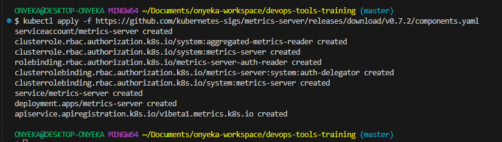
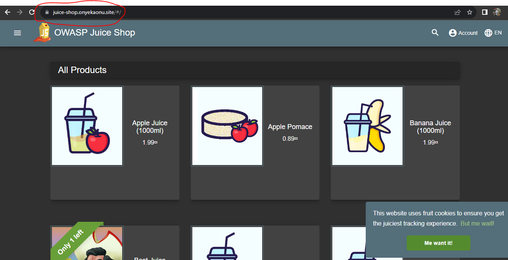

# Continuous Deployment with GitLab, Helm, and AWS EKS

## References

https://2021-03-lke.container.training/

https://www.youtube.com/watch?v=ZFABsUCMESU&list=PLTnRtjQN5ieYD97JCZtcGbIjq1EINih2G&index=7

This will show you how to deploy a complete CI/CD pipeline on AWS EKS

## Module 1

- Get ready!

- Our sample application

- Deploying our ELS cluster

- Quick Kubernetes review

- Accessing internal services

- DNS, Ingress, Metrics

## Module 2

- Managing stacks with Helm

- ExternalDNS

- Installing nginx ingress

- Installing metrics-server

- Prometheus and Grafana

- cert-manager

- CI/CD with GitLab

## Get ready!
We're going to set up a whole Continous Deployment pipeline
... for Kubernetes apps
... on a Kubernetes cluster
Ingredients: cert-manager, GitLab, Helm, AWS DNS, EKS, NGINX-INGRESS

### What we're going to do
- Spin up an EKS cluster
- Run a simple test app
- Install a few extras
- Set up GitLab
- Push an app with a CD pipeline to GitLab

### What you need to have
If you want to run this on your own...
- AWS account
- A domain name that you will point to AWS DNS(I got onyeka.ga)
- Local tools to control your Kubernetes cluster:
        kubectl
        helm
- Patience, as many operations will require us to wait a few minutes!

### Why do I need a domain name?
- Because accessing gitlab.onyeka.ga is easier than 102.34.55.67
- Because we'll need TLS certificates (and it's very easy to obtain certs with Let's Encrypt when we have a domain)
- We'll illustrate automatic DNS configuration with ExternalDNS, too! (Kubernetes will automatically create DNS entries in our domain)

### Warning ⚠️💸
- We're going to spin up cloud resources
- Remember to shut them down when you're done!
- In the immortal words of Cloud Economist Corey Quinn: You're charged for what you forget to turn off.

### Deploying our EKS cluster
- If we wanted to deploy Kubernetes manually, what would we need to do? (not that I recommend doing that...)
- Control plane (etcd, API server, scheduler, controllers)
- Nodes (VMs with a container engine + the Kubelet agent; CNI setup)
- High availability (etcd clustering, API load balancer)
- Security (CA and TLS certificates everywhere)
- Cloud integration (to provision LoadBalancer services, storage...)
- And that's just to get a basic cluster! 
- Refer to https://github.com/onyeka-hub/Project-21.git for guidelines

### Managed Kubernetes
- Cloud provider runs the control plane (including etcd, API load balancer, TLS setup, cloud integration)
- We or cloud provider run nodes (the cloud provider generally gives us an easy way to provision them)
- Get started in minutes
- We're going to use AWS EKS Kubernetes Engine

### Creating a cluster
From your command line, using Terraform deploy a version of eks of your choice
Refer to [here](https://github.com/onyeka-hub/terraform-eks-module.git)

### Quick Kubernetes review
- Let's deploy a simple HTTP server
- And expose it to the outside world!
- Feel free to skip this section if you're familiar with Kubernetes

### Creating a container
On Kubernetes, one doesn't simply run a container

We need to create a "Pod"

A Pod will be a group of containers running together (often, it will be a group of one container)

We can create a standalone Pod, but generally, we'll use a controller (for instance: Deployment, Replica Set, Daemon Set, Job, Stateful Set...)

The controller will take care of scaling and recreating the Pod if needed (note that within a Pod, containers can also be restarted automatically if needed)

### A controller, you said?
We're going to use one of the most common controllers: a Deployment

#### Deployments...
- can be scaled (will create the requested number of Pods)
- will recreate Pods if e.g. they get evicted or their Node is down
- handle rolling updates
- Deployments actually delegate a lot of these tasks to Replica Sets
- We will generally have the following hierarchy:
- Deployment → Replica Set → Pod

#### Exposing the Deployment
- We need to create a Service
- We can use kubectl expose for that 
- For internal use, we can use the default Service type, ClusterIP:
        `kubectl expose deployment web --port=80`
- For external use, we can use a Service of type LoadBalancer:
        `kubectl expose deployment web --port=80 --type=LoadBalancer`

#### Changing the Service type
- We can kubectl delete service web and recreate it
- Or, kubectl edit service web and dive into the YAML
- Or, kubectl patch service web --patch '{"spec": {"type": "LoadBalancer"}}'
- ... These are just a few "classic" methods; there are many ways to do this!

#### Deployment → Pod
- Can we check exactly what's going on when the Pod is created?

- Option 1: watch kubectl get all
        - displays all object types
        - refreshes every 2 seconds
        - puts a high load on the API server when there are many objects

- Option 2: kubectl get pods --watch --output-watch-events
        - can only display one type of object
        - will show all modifications happening (à la tail -f)
        - doesn't put a high load on the API server (except for initial display)

### Accessing internal services
- How can we temporarily access a service without exposing it to everyone?
- kubectl proxy: gives us access to the API, which includes a proxy for HTTP resources
- kubectl port-forward: allows forwarding of TCP ports to arbitrary pods, services, ...

#### kubectl proxy in theory
- Running kubectl proxy gives us access to the entire Kubernetes API
- The API includes routes to proxy HTTP traffic
- These routes look like the following:
        `/api/v1/namespaces/<namespace>/services/<service>/proxy`
- We just add the URI to the end of the request, for instance:
        `/api/v1/namespaces/<namespace>/services/<service>/proxy/index.html`
- We can access services and pods this way

#### kubectl proxy in practice
- Let's access the web service through kubectl proxy
- Run an API proxy in the background:
        `kubectl proxy &`
- Access the web service:
        `curl localhost:8001/api/v1/namespaces/default/services/web/proxy/`
- Terminate the proxy:
        `kill %1`

#### kubectl port-forward in theory
- What if we want to access a TCP service?
- We can use kubectl port-forward instead
- It will create a TCP relay to forward connections to a specific port (of a pod, service, deployment...)
- The syntax is:
        `kubectl port-forward service/name_of_service local_port:remote_port`

- If only one port number is specified, it is used for both local and remote ports  

#### kubectl port-forward in practice
- Let's access our remote NGINX server
- Forward connections from local port 1234 to remote port 80:
        `kubectl port-forward svc/web 1234:80 &`
- Connect to the NGINX server:
        `curl localhost:1234`
- Terminate the port forwarder:
        `kill %1`

## DNS, Ingress, Metrics
- We got a basic app up and running
- We accessed it over a raw IP address
- Can we do better? (i.e. access it with a domain name!)
- How much resources is it using?

### DNS
- We'd like to associate a fancy name to that LoadBalancer Service (e.g. nginx.onyeka.ga → A.B.C.D)
- option 1: manually add a DNS record
- option 2: find a way to create DNS records automatically
- We will install ExternalDNS to automate DNS records creaton
- ExternalDNS supports AWS DNS and dozens of other providers

### Ingress
- What if we have multiple web services to expose?
- We could create one LoadBalancer Service for each of them
- This would create a lot of cloud load balancers (and they typically incur a cost, even if it's a small one)
- Instead, we can use an Ingress Controller
- Ingress Controller = HTTP load balancer / reverse proxy
- Put all our HTTP services behind a single LoadBalancer Service
- Can also do fancy "content-based" routing (using headers, request path...)
- We will install nginx as our Ingress Controller

### Metrics
- How much resources are we using right now?
- When will we need to scale up our cluster?
- We need metrics!
- We're going to install the metrics server
- It's a very basic metrics system (no retention, no graphs, no alerting...)
- But it's lightweight, and it is used internally by Kubernetes for autoscaling

### What's next
- We're going to install all these components
- Very often, things can be installed with a simple YAML file
- Very often, that YAML file needs to be customized a little bit (add command-line parameters, provide API tokens...)
- Instead, we're going to use Helm charts
- Helm charts give us a way to customize what we deploy
- Helm can also keep track of what we install (for easier uninstall and updates)

## Helm concepts
- helm is a CLI tool
- It is used to find, install, upgrade charts
- A chart is an archive containing templatized YAML bundles
- Charts are versioned
- Charts can be stored on private or public repositories

### Charts and repositories
A repository (or repo in short) is a collection of charts. It's just a bunch of files, (they can be hosted by a static HTTP server, or on a local directory).

We can add "repos" to Helm, giving them a nickname. The nickname is used when referring to charts on that repo. (for instance, if we try to install hello/world, that means the chart world on the repo hello; and that repo hello might be something like https://blahblah.hello.io/charts/)

### How to find charts
Go to the Artifact Hub (https://artifacthub.io). Or use helm search hub ... from the CLI. Let's try to find a Helm chart for something called "OWASP Juice Shop"!. (it is a famous demo app used in security challenges)

### Finding charts from the CLI
We can use helm search hub <keyword>

Look for the OWASP Juice Shop app:

`helm search hub owasp juice`

Since the URLs are truncated, try with the YAML output:

`helm search hub owasp juice -o yaml`

Then go to → https://artifacthub.io/packages/helm/seccurecodebox/juice-shop

### Finding charts on the web
We can also use the Artifact Hub search feature. Go to https://artifacthub.io/. In the search box on top, enter "owasp juice". Click on the "juice-shop" result (not "multi-juicer" or "juicy-ctf")

### Installing the chart
- Click on the "Install" button, it will show instructions
- First, add the repository for that chart:
```sh
helm repo add securecodebox https://charts.securecodebox.io/
```

- Then, install the chart:
```sh
helm upgrade --install juice-shop securecodebox/juice-shop  --namespace juice-shop --create-namespace
```

Note: it is also possible to install directly a chart, with --repo https://...

### Charts and releases
"Installing a chart" means creating a release. In the previous exemple, the release was named "my-juice-shop". We can also use --generate-name to ask Helm to generate a name for us.

List the releases:
```sh
helm list -n juice-shop
```

Check that we have a my-juice-shop-... Pod up and running:
```sh
kubectl get pods -n juice-shop
```

### Viewing resources of a release
This specific chart labels all its resources with a release label. We can use a selector to see these resources

List all the resources created by this release:
```sh
kubectl get all --selector=app.kubernetes.io/instance=juice-shop -n juice-shop
```

Note: this label wasn't added automatically by Helm.
It is defined in that chart. In other words, not all charts will provide this label.

### Configuring a release
By default, juice/juice-shop creates a service of type ClusterIP. We would like to change that to a NodePort. We could use kubectl edit service my-juice-shop, but  our changes would get overwritten next time we update that chart!

Instead, we are going to set a value. Values are parameters that the chart can use to change its behavior. Values have default values. Each chart is free to define its own values and their defaults.

### Checking possible values
We can inspect a chart with helm show or helm inspect
Look at the README for the app:

```sh
helm show readme securecodebox/juice-shop
```

Look at the values and their defaults:

```sh
helm show values securecodebox/juice-shop
```

The values may or may not have useful comments. The readme may or may not have (accurate) explanations for the values. (If we're unlucky, there won't be any indication about how to use the values!)

### Setting values
Values can be set when installing a chart, or when upgrading it. We are going to update my-juice-shop to change the type of the service.

Update my-juice-shop:
```sh
helm upgrade juice-shop securecodebox/juice-shop --set service.type=NodePort -n juice-shop
```

We can set multiple values. If we want to set many values, we can use -f/--values and pass a YAML file with all the values. All unspecified values will take the default values defined in the chart.

### Connecting to the Juice Shop
Let's check the app that we just installed.

Check the node port allocated to the service:
```sh
kubectl get service -n juice-shop 
```

PORT=$(kubectl get service my-juice-shop -o jsonpath={..nodePort})

Connect to it:
```sh
curl localhost:$PORT/
```


## ExternalDNS
ExternalDNS will automatically create DNS records from Kubernetes resources

- Services (with the annotation external-dns.alpha.kubernetes.io/hostname)
- Ingresses (automatically)

It requires a domain name (obviously)... And that domain name should be configurable through an API. As of April 2021, it supports a few dozens of providers. We're going to use AWS DNS.

### Deploying ExternalDNS
The ExternalDNS documentation has a tutorial for AWS. It's basically a lot of YAML! That's where using a Helm chart will be very helpful. There are a few ExternalDNS charts available out there. We will use the one from  https://kubernetes-sigs.github.io/external-dns/ .

#### How we'll install things with Helm
We will install each chart in its own namespace. (this is not mandatory, but it helps to see what belongs to what).

We will use helm upgrade --install instead of helm install, (that way, if we want to change something, we can just re-run the command)

We will use the --create-namespace and --namespace ... options

To keep things boring and predictible, if we are installing chart xyz:

- we will install it in namespace xyz
- we will name the release xyz as well

### Installing ExternalDNS
First, let's add the Externaldns repo:
```sh
helm repo add external-dns https://kubernetes-sigs.github.io/external-dns/
```

#### Prerequisite for installing ExternalDNS
To set up externaldns on aws eks cluster, please refer to this documentation for the neccessary steps like permission, externaldns service account, etc before installation.

#### Short description
ExternalDNS is a pod that runs in your Amazon EKS cluster. To use ExternalDNS as a plugin with Amazon EKS, set up AWS Identity and Access Management (IAM) permissions. These permissions must allow Amazon EKS access to Amazon Route 53.

**Note**: Before starting the following resolution, make sure that a domain name and a Route 53 hosted zone exist.
#### Steps
1. Set up IAM permissions to give the ExternalDNS pod permissions to create, update, and delete Route 53 records in your AWS account.

From the aws console create an IAM policy with the policy below and name it 'external-dns':
```json
{
  "Version": "2012-10-17",
  "Statement": [
    {
      "Effect": "Allow",
      "Action": [
        "route53:ChangeResourceRecordSets"
      ],
      "Resource": [
        "arn:aws:route53:::hostedzone/*"
      ]
    },
    {
      "Effect": "Allow",
      "Action": [
        "route53:ListHostedZones",
        "route53:ListResourceRecordSets"
      ],
      "Resource": [
        "*"
      ]
    }
  ]
}
```
**Note**: You can also adjust the preceding policy to allow updates to explicit hosted zone IDs.

2. Use the preceding policy to create a service account for external-dns:
```sh
eksctl create iamserviceaccount --name SERVICE_ACCOUNT_NAME --namespace NAMESPACE --cluster CLUSTER_NAME --attach-policy-arn IAM_POLICY_ARN --approve
```
Or
```sh
eksctl create iamserviceaccount --name external-dns --namespace external-dns --cluster onyeka-eks-version-19-20-0 --attach-policy-arn arn:aws:iam::938106001005:policy/external-dns --approve
```

To check the name of your service account, run the following command:
```sh
kubectl get sa -n external-dns
```

Example output:
```
NAME           SECRETS   AGE
default        0         23h
external-dns   0         23h
```

In the preceding example output, external-dns is the name that was given to the service account when it was created. Make sure you have eksctl intalled on your system.

#### Verify the Service Account and IAM Role Association
Make sure that the service account is properly annotated with the IAM role. You can check this by describing the service account:

```sh
kubectl describe serviceaccount external-dns --namespace external-dns
```

You should see an annotation similar to this:

```
Annotations:  eks.amazonaws.com/role-arn: arn:aws:iam::938106001005:role/your-iam-role-name
```
This confirms that the IAM role is associated with the service account.

3. Then, install ExternalDNS:
```sh
helm upgrade --install external-dns external-dns/external-dns \
  --namespace external-dns --create-namespace \
  --set serviceAccount.create=false,serviceAccount.name=external-dns
```
Or
```sh
helm upgrade --install external-dns external-dns/external-dns --set serviceAccount.create=false,serviceAccount.name=external-dns --namespace external-dns
```

4.    Verify that the deployment was successful:
```sh
kubectl get deployments -n external-dns
```

Example output:
```
NAME           READY   UP-TO-DATE   AVAILABLE   AGE
external-dns   1/1     1            1           85m
```

You can also check the logs to verify that the records are up to date:
```sh
kubectl logs external-dns-9f85d8d5b-sx5fg -n external-dns
```

Output

```
....
....
time="2022-02-10T20:22:02Z" level=info msg="Instantiating new Kubernetes client"
time="2022-02-10T20:22:02Z" level=info msg="Using inCluster-config based on serviceaccount-token"
time="2022-02-10T20:22:02Z" level=info msg="Created Kubernetes client https://10.100.0.1:443"
time="2022-02-10T20:22:09Z" level=info msg="Applying provider record filter for domains: [<yourdomainname>.com. .<yourdomainname>.com.]"
time="2022-02-10T20:22:09Z" level=info msg="All records are already up to date"
....
....
```

5. Verify that ExternalDNS is working
- In our own case where we already have the juice-shop service which is currently a ClusterIP type, update this service to type LoadBalancer and annotate with external-dns configuration.

- Or Create a service that's exposed as LoadBalancer and that can be routed externally through the domain name that's hosted on Route 53 or edit the juice-shop service to a type LoadBalancer and annotate it.

Manifest:
```yaml
apiVersion: v1
kind: Service
metadata:
  name: nginx
  annotations:
    external-dns.alpha.kubernetes.io/hostname: DOMAIN_NAME
spec:
  ports:
    - port: 80
      targetPort: 80
      protocol: TCP
  type: LoadBalancer
  selector:
    app: nginx
```

```sh
kubectl apply SERVICE_MANIFEST_FILE_NAME.yaml
```

- Check that the NGINX service was created with the LoadBalancer type:
```sh
kubectl get svc
```

Example output:
```
NAME         TYPE           CLUSTER-IP      EXTERNAL-IP                                                              PORT(S)        AGE
kubernetes   ClusterIP      10.100.0.1      <none>                                                                   443/TCP        26h
nginx        LoadBalancer   10.100.234.77   a1ef09255d52049f487e05b4f74faea6-954147917.us-west-1.elb.amazonaws.com   80:30792/TCP   74m
```

Note: The service automatically creates a Route 53 record for the hosted zone.

Check the logs to verify that the Route 53 record was created:
```sh
kubectl logs external-dns-9f85d8d5b-sx5fg
```

Example output:
```
...
...
...
time="2022-02-10T21:22:43Z" level=info msg="Applying provider record filter for domains: [<domainname>.com. .<domainname>.com.]"
time="2022-02-10T21:22:43Z" level=info msg="Desired change: CREATE <domainname>.com A [Id: /hostedzone/Z01155763Q6AN7CEI3AP6]"
time="2022-02-10T21:22:43Z" level=info msg="Desired change: CREATE <domainname>.com TXT [Id: /hostedzone/Z01155763Q6AN7CEI3AP6]"
time="2022-02-10T21:22:43Z" level=info msg="2 record(s) in zone xxx.com. [Id: /hostedzone/Z01155763Q6AN7CEI3AP6] were successfully updated"
time="2022-02-10T21:23:43Z" level=info msg="Applying provider record filter for domains: [<domainname>.com. .<domainname>.com.]"
time="2022-02-10T21:23:43Z" level=info msg="All records are already up to date"
...
...
...
```


For more information and examples for ExternalDNS, see Setting up ExternalDNS for services on AWS (on the GitHub website) and Set up ExternalDNS (on the Kubernetes website).

[Here](https://github.com/kubernetes-sigs/external-dns/blob/master/docs/tutorials/aws.md#iam-policy)


## Installing Ingress-Nginx
Nginx is going to be our Ingress Controller

Let's install it with a Helm chart, in its own namespace

First, let's add the nginx chart repository:
```sh
helm repo add ingress-nginx https://kubernetes.github.io/ingress-nginx
or
helm repo update
```

Then, install the chart:
```sh
helm upgrade -i ingress-nginx ingress-nginx/ingress-nginx \
    --version 4.2.3 \
    --create-namespace --namespace ingress-nginx\
```
OR
```sh
helm upgrade -i ingress-nginx ingress-nginx/ingress-nginx --version 4.8.3 --create-namespace --namespace ingress-nginx 
```

Output
```
amespace ingress-nginx
Release "ingress-nginx" does not exist. Installing it now.
NAME: ingress-nginx
LAST DEPLOYED: Tue Nov 21 08:43:45 2023
NAMESPACE: ingress-nginx
STATUS: deployed
REVISION: 1
TEST SUITE: None
NOTES:
The ingress-nginx controller has been installed.
It may take a few minutes for the LoadBalancer IP to be available.
You can watch the status by running 'kubectl --namespace ingress-nginx get services -o wide -w ingress-nginx-controller'

An example Ingress that makes use of the controller:
  apiVersion: networking.k8s.io/v1
  kind: Ingress
  metadata:
    name: example
    namespace: foo
  spec:
    ingressClassName: nginx
    rules:
      - host: www.example.com
        http:
          paths:
            - pathType: Prefix
              backend:
                service:
                  name: exampleService
                  port:
                    number: 80
              path: /
    # This section is only required if TLS is to be enabled for the Ingress
    tls:
      - hosts:
        - www.example.com
        secretName: example-tls

If TLS is enabled for the Ingress, a Secret containing the certificate and key must also be provided:

  apiVersion: v1
  kind: Secret
  metadata:
    name: example-tls
    namespace: foo
  data:
    tls.crt: <base64 encoded cert>
    tls.key: <base64 encoded key>
  type: kubernetes.io/tls
```

Checking the ingress controller
```sh
kubectl -n ingress-nginx rollout status deployment ingress-nginx-controller

kubectl get deployment -n ingress-nginx ingress-nginx-controller
```


### Testing Ingress-nginx
Let's create an Ingress resource!

Create an ingress-juice-shop.yaml file with the code below:
```yaml
apiVersion: networking.k8s.io/v1
kind: Ingress
metadata:
  name: "ingress-juice-shop"
  namespace: juice-shop
spec:
  ingressClassName: nginx
  rules:
  - host: "juice-shop.onyeka.ga"
    http:
      paths:
      - pathType: Prefix
        path: "/"
        backend:
          service:
            name: juice-shop
            port:
              number: 3000
```

Deploy the Ingress by running the following:
```sh
kubectl apply -f ingress-juice-shop.yaml -n juice-shop
```

**Note**: Make sure that the juice-shop service is listening on port 80 otherwise edit it

## Blocker
```
$ kubectl apply -f ingress-juice-shop.yaml 
Error from server (InternalError): error when creating "ingress-juice-shop.yaml": Internal error occurred: failed calling webhook "validate.nginx.ingress.kubernetes.io": failed to call webhook: Post "https://ingress-nginx-controller-admission.ingress-nginx.svc:443/networking/v1/ingresses?timeout=10s": context deadline exceeded
```


### Solution
I was recommended to remove the ValidatingWebhookConfiguration from the applied manfiest. You can also remove it manually with
```sh
kubectl delete ValidatingWebhookCOnfiguration ingress-nginx-admission
```

(Validating Controllers aren't namespaced)

Applying the file again and it was created.


After a short delay (IP address binding may take a bit longer) we should be able to see the state of the Ingress resource:

Check that the Ingress was correctly created:
```sh
kubectl get ingress -n juice-shop

kubectl describe ing ingress-juice-shop -n juice-shop
```

```
$ kubectl get ingress -n juice-shop
NAME                 CLASS   HOSTS                  ADDRESS                                                 
                 PORTS   AGE
ingress-juice-shop   nginx   juice-shop.onyeka.ga   a5f112bc442eb49f9a9607e1280dc5b7-643046540.us-east-2.elb.amazonaws.com   80      3m6s
```

### Does it work?
Try to connect to the Ingress host name (in my example, http://juice-shop.onyeka.ga/)


## Installing metrics-server
We've installed a few things on our cluster so far

How much resources (CPU, RAM) are we using?

We need metrics!

If metrics-server is installed, we can get Nodes metrics like this:
```sh
kubectl top nodes
```
At the moment, this should show us error: Metrics API not available

How do we fix this?

### Many ways to get metrics
We could use a SAAS like Datadog, New Relic...

We could use a self-hosted solution like Prometheus

Or we could use metrics-server

What's special about metrics-server?

### Pros/cons
#### Cons:

no data retention (no history data, just instant numbers)

only CPU and RAM of nodes and pods (no disk or network usage or I/O...)

#### Pros:

very lightweight

doesn't require storage

used by Kubernetes autoscaling

### Why metrics-server
We may install something fancier later, (think: Prometheus with Grafana). But metrics-server will work in minutes. It will barely use resources on our cluster. It's required for autoscaling anyway

### How metric-server works
It runs a single Pod

That Pod will fetch metrics from all our Nodes

It will expose them through the Kubernetes API agregation layer

### Installing metrics-server (you can deploy metric-server with kubectl or with helm)
1. Deploy the Metrics Server with the following command:

```sh
kubectl apply -f https://github.com/kubernetes-sigs/metrics-server/releases/download/v0.7.2/components.yaml
```



2. Verify that the metrics-server deployment is running the desired number of pods with the following command.

```sh
kubectl get deployment metrics-server -n kube-system
```

The example output is as follows.
```
NAME             READY   UP-TO-DATE   AVAILABLE   AGE
metrics-server   1/1     1            1           6m
```

In a lot of places, this is done with a little bit of custom YAML (derived from the official installation instructions). We're going to use Helm one more time:

```sh
helm upgrade --install metrics-server bitnami/metrics-server \
  --create-namespace --namespace metrics-server \
  --set apiService.create=true \
  --set extraArgs.kubelet-insecure-tls=true \
  --set extraArgs.kubelet-preferred-address-types=InternalIP
```

What are these options for?

### Installation options
**apiService.create=true**: register metrics-server with the Kubernetes agregation layer (create an entry that will show up in kubectl get apiservices)

**extraArgs.kubelet-insecure-tls=true**: when connecting to nodes to collect their metrics, don't check kubelet TLS certs (because most kubelet certs include the node name, but not its IP address)

**extraArgs.kubelet-preferred-address-types=InternalIP**: when connecting to nodes, use their internal IP address instead of node name (because the latter requires an internal DNS, which is rarely configured)

### Testing metrics-server
After a minute or two, metrics-server should be up

We should now be able to check Nodes resource usage:

```sh
kubectl top nodes
```

And Pods resource usage, too:

```sh
kubectl top pods --all-namespaces
```

### Keep some padding
The RAM usage that we see should correspond more or less to the Resident Set Size

Our pods also need some extra space for buffers, caches...

Do not aim for 100% memory usage!

Some more realistic targets:

50% (for workloads with disk I/O and leveraging caching)

90% (on very big nodes with mostly CPU-bound workloads)

75% (anywhere in between!)


## Prometheus and Grafana
What if we want metrics retention, view graphs, trends?. A very popular combo is Prometheus+Grafana:

Prometheus as the "metrics engine"

Grafana to display comprehensive dashboards

Prometheus also has an alert-manager component to trigger alerts

### Installing Prometheus and Grafana
- A complete metrics stack needs at least:

- the Prometheus server (collects metrics and stores them efficiently)
- a collection of exporters (exposing metrics to Prometheus)
- Grafana
- a collection of Grafana dashboards (building them from scratch is tedious)

- The Helm chart kube-prometheus-stack combines all these elements

- ... So we're going to use it to deploy our metrics stack!

### Installing kube-prometheus-stack
Let's install that stack directly from its repo (without doing helm repo add first)

Otherwise, keep the same naming Onu:

```sh
helm upgrade --install kube-prometheus-stack kube-prometheus-stack \
  --namespace kube-prometheus-stack --create-namespace \
  --repo https://prometheus-community.github.io/helm-charts

OR

helm upgrade --install kube-prometheus-stack kube-prometheus-stack --namespace kube-prometheus-stack --create-namespace --repo https://prometheus-community.github.io/helm-charts
```

OR
```sh
helm repo add prometheus-community https://prometheus-community.github.io/helm-charts
helm upgrade --install kube-prometheus-stack prometheus-community/kube-prometheus-stack --namespace kube-prometheus-stack --create-namespace
```

This will take a minute...

Then check what was installed:
```sh
kubectl get all --namespace kube-prometheus-stack
```

### Exposing Grafana
Let's create an Ingress for Grafana

```sh
kubectl create ingress --namespace kube-prometheus-stack grafana \
  --rule=grafana.onyeka.ga/*=kube-prometheus-stack-grafana:80
```
Or create and apply ingress-grafana.yaml with the code below:

```yaml
apiVersion: networking.k8s.io/v1
kind: Ingress
metadata:
  name: "ingress-grafana"
  namespace: kube-prometheus-stack
spec:
  ingressClassName: nginx
  rules:
  - host: "grafana.onyeka.ga"
    http:
      paths:
      - pathType: Prefix
        path: "/"
        backend:
          service:
            name: kube-prometheus-stack-grafana
            port:
              number: 80
```

Deploy the Ingress by running the following:
```sh
kubectl apply -f ingress-grafana.yaml -n kube-prometheus-stack
```

Connect to Grafana at grafana.onyeka.ga, (remember that the DNS record might take a few minutes to come up)


### Grafana credentials
What could the login and password be?

Let's look at the Secrets available in the namespace:

```sh
kubectl get secrets --namespace kube-prometheus-stack
```
There is a kube-prometheus-stack-grafana that looks promising!

Decode the Secret:
```sh
kubectl get secret --namespace kube-prometheus-stack \
  kube-prometheus-stack-grafana -o json | jq '.data | map_values(@base64d)'

kubectl get secrets kube-prometheus-stack-grafana -n kube-prometheus-stack -o json | jq '.data' 
```

If you don't have the jq tool mentioned above, don't worry...

The login/password is hardcoded to **admin/prom-operator** 😬

Or you run a describe on the grafana secret and base64 decode the admin-password and the admin-user.
```sh
kubectl get secret kube-prometheus-stack-grafana -n kube-prometheus-stack -o yaml
apiVersion: v1
data:
  admin-password: cHJvbS1vcGVyYXRvcg==
  admin-user: YWRtaW4=
  creationTimestamp: "2023-02-21T15:35:47Z"
  labels:
    app.kubernetes.io/instance: kube-prometheus-stack
    app.kubernetes.io/managed-by: Helm
    app.kubernetes.io/name: grafana
    app.kubernetes.io/version: 9.3.6
    helm.sh/chart: grafana-6.50.7
  name: kube-prometheus-stack-grafana
  namespace: kube-prometheus-stack
  resourceVersion: "124183"
  uid: f8852104-9e29-4755-b1a1-51243a462605
type: Opaque
```


### Grafana dashboards
Once logged in, click on the "Dashboards" icon on the left, (it's the one that looks like four squares). Then click on the "Manage" entry

Then click on "Kubernetes / Compute Resources / Cluster"

This gives us a breakdown of resource usage by Namespace

Feel free to explore the other dashboards!


## cert-manager
cert-manager¹ facilitates certificate signing through the Kubernetes API:

- we create a Certificate object (that's a CRD)

- cert-manager creates a private key

- it signs that key ...

- ... or interacts with a certificate authority to obtain the signature

- it stores the resulting key+cert in a Secret resource

These Secret resources can be used in many places (Ingress, mTLS, ...)

### Getting signatures
cert-manager can use multiple Issuers (another CRD), including:

- self-signed
- cert-manager acting as a CA
- the ACME protocol (notably used by Let's Encrypt)
- HashiCorp Vault

Multiple issuers can be configured simultaneously

Issuers can be available in a single namespace, or in the whole cluster

(then we use the ClusterIssuer CRD)

### cert-manager in action
We will install cert-manager

We will create a ClusterIssuer to obtain certificates with Let's Encrypt, (this will involve setting up an Ingress Controller)

We will create a Certificate request

cert-manager will honor that request and create a TLS Secret

### Installing cert-manager

### Steps
1. Set up an IAM policy

cert-manager needs to be able to add records to Route53 in order to solve the DNS01 challenge. To enable this, create a IAM policy with the name **PolicyForCertManager**, with following permissions:

```json
{
  "Version": "2012-10-17",
  "Statement": [
    {
      "Effect": "Allow",
      "Action": "route53:GetChange",
      "Resource": "arn:aws:route53:::change/*"
    },
    {
      "Effect": "Allow",
      "Action": [
        "route53:ChangeResourceRecordSets",
        "route53:ListResourceRecordSets"
      ],
      "Resource": "arn:aws:route53:::hostedzone/*"
    },
    {
      "Effect": "Allow",
      "Action": "route53:ListHostedZonesByName",
      "Resource": "*"
    }
  ]
}
```

**Note**: The route53:ListHostedZonesByName statement can be removed if you specify the (optional) hostedZoneID. You can further tighten the policy by limiting the hosted zone that cert-manager has access to (e.g. arn:aws:route53:::hostedzone/DIKER8JEXAMPLE).

2. Create the IAM role for cert-manager with name **RoleForCertManager**. After you create the IAM policy, you must create an IAM role with Select **trusted entity - Custom trust policy**. Use the trustpolicy.json sample file below as a guide. Attach the **PolicyForCertManager** you created to this role.

```json
{
    "Version": "2012-10-17",
    "Statement": [
        {
            "Effect": "Allow",
            "Principal": {
                "Federated": "arn:aws:iam::958217526797:oidc-provider/oidc.eks.us-east-2.amazonaws.com/id/8BB983F9CC161E9DF9D69E994B6F6F3E"
            },
            "Action": "sts:AssumeRoleWithWebIdentity",
            "Condition": {
                "StringEquals": {
                    "oidc.eks.us-east-2.amazonaws.com/id/8BB983F9CC161E9DF9D69E994B6F6F3E:sub": "system:serviceaccount:cert-manager:cert-manager",
                    "oidc.eks.us-east-2.amazonaws.com/id/8BB983F9CC161E9DF9D69E994B6F6F3E:aud": "sts.amazonaws.com"
                }
            }
        }
    ]
}
```

3. Create a Kubernetes service account and associate it with IAM role. You can use eksctl command bellow. **Note**: create the cert-manager namespace before running the command:

```sh
eksctl create iamserviceaccount --name my-service-account --namespace <namespace> --cluster my-cluster --attach-role-arn <ARN of the role to attach to the iamserviceaccount> --approve
```

Or
```sh
eksctl create iamserviceaccount --name cert-manager --namespace cert-manager --cluster onyeka-eks-version-19-20-0 --attach-role-arn arn:aws:iam::255913473442:role/RoleForCertManager --approve
```

To check the name of your service account, run the following command:
```sh
kubectl get sa -n cert-manager
```

Example output:
```
NAME                      SECRETS   AGE
cert-manager              0         137m
default                   0         147m
```

In the preceding example output, cert-manager is the name that was given to the service account when it was created. Make sure you have eksctl intalled on your system.

As you can see the serviceaccount does not have secrets/tokens. ServiceAccounts use signed JSON Web Tokens (JWTs) to authenticate to the Kubernetes API server, and to any other system where a trust relationship exists. Depending on how the token was issued (either time-limited using a TokenRequest or using a legacy mechanism with a Secret), a ServiceAccount token might also have an expiry time, an audience, and a time after which the token starts being valid. When a client that is acting as a ServiceAccount tries to communicate with the Kubernetes API server, the client includes an Authorization: Bearer `<token>` header with the HTTP request. The API server checks the validity of that bearer token as follows: 
- Checks the token signature.
- Checks whether the token has expired.
- Checks whether object references in the token claims are currently valid.
- Checks whether the token is currently valid.
- Checks the audience claims.
The TokenRequest API produces bound tokens for a ServiceAccount. This binding is linked to the lifetime of the client, such as a Pod, that is acting as that ServiceAccount.

4. So we are going to create a secret with name secret-cert-manager.yaml for the cert-manager sa with the file below.

```yaml
apiVersion: v1
kind: Secret
metadata:
  name: cert-manager
  namespace:  cert-manager
  annotations:
    kubernetes.io/service-account.name: "cert-manager"
type: kubernetes.io/service-account-token
```

```sh
kubectl apply -f secret-cert-manager.yaml
```

5. Patch the cert-manager's service account with the secret created with the below command 
```sh
kubectl patch serviceaccount <name of the service account> -p '{"secrets": [{"name": "name of the secret"}]}' -n namespace-of-the-serviceaccount

kubectl patch serviceaccount cert-manager -p '{"secrets": [{"name": "cert-manager"}]}' -n cert-manager
```

Output
```
$ kubectl get sa -n cert-manager
NAME                      SECRETS   AGE
cert-manager              1         158m
default                   0         168m
```

Or you can edit each service account and put the part for the secret as shown below

```sh
kubectl edit sa cert-manager -n cert-manage
```

## Before editing
```yaml
# Please edit the object below. Lines beginning with a '#' will be ignored,
# and an empty file will abort the edit. If an error occurs while saving this file will be
# reopened with the relevant failures.
#
apiVersion: v1
kind: ServiceAccount
metadata:
  annotations:
    eks.amazonaws.com/role-arn: arn:aws:iam::255913473442:role/RoleForCertManager
  creationTimestamp: "2023-11-21T12:39:34Z"
  labels:
    app.kubernetes.io/managed-by: eksctl
  name: cert-manager
  namespace: cert-manager
  resourceVersion: "815262"
  uid: 2436d17c-42ed-4137-9336-f3d5bb1b7388
```

## After editing
```yaml
apiVersion: v1
kind: ServiceAccount
metadata:
  annotations:
    eks.amazonaws.com/role-arn: arn:aws:iam::255913473442:role/RoleForCertManager
  creationTimestamp: "2023-11-21T12:39:34Z"
  labels:
    app.kubernetes.io/managed-by: eksctl
  name: cert-manager
  namespace: cert-manager
  resourceVersion: "850303"
  uid: 2436d17c-42ed-4137-9336-f3d5bb1b7388
secrets:
- name: cert-manager
```

6. Then, install cert-manager:

Before installing the chart, you must first install the cert-manager CustomResourceDefinition resources. This is performed in a separate step to allow you to easily uninstall and reinstall cert-manager without deleting your installed custom resources.

```sh
kubectl apply -f https://github.com/cert-manager/cert-manager/releases/download/v1.15.3/cert-manager.crds.yaml


## Add the Jetstack Helm repository
helm repo add cert-manager https://charts.jetstack.io

## Install the cert-manager helm chart
helm upgrade -i cert-manager --version 1.15.3 cert-manager/cert-manager -n cert-manager --set serviceAccount.create=false,serviceAccount.name=cert-manager

OR Let's add the repo and install the cert-manager Helm chart with this one-liner:

helm install cert-manager cert-manager \
    --repo https://charts.jetstack.io \
    --create-namespace --namespace cert-manager \
```

If you want to completely uninstall cert-manager from your cluster, you will also need to delete the previously installed CustomResourceDefinition resources:
```sh
kubectl delete -f https://github.com/cert-manager/cert-manager/releases/download/v1.15.3/cert-manager.crds.yaml
```

7. Verify that the deployment was successful:
```sh
kubectl get deployments -n cert-manager

NAME                      READY   UP-TO-DATE   AVAILABLE   AGE
cert-manager              1/1     1            1           89s
cert-manager-cainjector   1/1     1            1           89s
cert-manager-webhook      1/1     1            1           89s
```
### ClusterIssuer manifest
Create a cm-clusterissuer.yaml with the below configuration

```yaml
apiVersion: cert-manager.io/v1
kind: ClusterIssuer
metadata:
  name: letsencrypt-staging
spec:
  acme:
    email: "onyekagodonu@yahoo.com"
    server: https://acme-staging-v02.api.letsencrypt.org/directory
    # To use the production environment, use the following line instead:
    #server: https://acme-v02.api.letsencrypt.org/directory
    privateKeySecretRef:
      name: letsencrypt-staging
    solvers:
    - selector:
        dnsZones:
          - "onyeka.ga"
      dns01:
        route53:
          region: "us-east-2"
          hostedZoneID: "Z0250004LZ1MP3VIBU47"
```

Create the ClusterIssuer:
```sh
kubectl apply -f cm-clusterissuer.yaml

kubectl get clusterissuer

NAME                  READY   AGE
letsencrypt-staging   True    7m36s
```

### Lets use the clusterissuer
1. First, lets see the manual way of using that. This is like telling the cert-manager to get the certificate for you. Note that certificates lives within a namespace

- Lets create the certificate

```yaml
#certificate.yaml manifest
apiVersion: cert-manager.io/v1
kind: Certificate
metadata:
  name: juice-shop.onyeka.ga
spec:
  secretName: juice-shop.onyeka.ga
  dnsNames:
  - juice-shop.onyeka.ga
  issuerRef:
    name: letsencrypt-staging
    kind: ClusterIssuer
```

The name, secretName, and dnsNames don't have to match.

There can be multiple dnsNames.

The issuerRef must match the ClusterIssuer that we created earlier.

Apply the certificate.yaml file

```sh
kubectl apply -f certificate.yaml -n juice-shop
```
#### What's happening?
cert-manager will create: the secret key, a Pod, a Service, and an Ingress to complete the HTTP challenge. Then it waits for the challenge to complete

View the resources created by cert-manager:

```sh
kubectl get pods,services,ingresses --selector=acme.cert-manager.io/http01-solver=true -n juice-shop

NAME                            READY   STATUS    RESTARTS   AGE
pod/cm-acme-http-solver-svr7d   1/1     Running   0          13m

NAME                                TYPE       CLUSTER-IP       EXTERNAL-IP   PORT(S)          AGE
service/cm-acme-http-solver-lmdp8   NodePort   172.20.110.126   <none>        8089:30513/TCP   13m

NAME                                                  CLASS    HOSTS             ADDRESS                                        
                          PORTS   AGE
ingress.networking.k8s.io/cm-acme-http-solver-w6bxp   <none>   nginx.onyeka.ga   a5f112bc442eb49f9a9607e1280dc5b7-643046540.us-east-2.elb.amazonaws.com   80      13m
```

The cert-manager will create a challange to verify the ownership of the domain which will take some time, before it can be able to tell letsencrypt to issue a certificate. The certificate will only be created when the challange is successfull.

#### HTTP challenge
The CA (in this case, Let's Encrypt) will fetch a particular URL:

http:// 

### Automatic TLS Ingress with annotations
It is also possible to annotate Ingress resources for cert-manager

If we annotate an Ingress resource with `cert-manager.io/cluster-issuer=xxx:`

- cert-manager will detect that annotation

- it will obtain a certificate using the specified ClusterIssuer `(xxx)`

- it will store the key and certificate in the specified Secret

Note: the Ingress still needs the `tls` section with `secretName` and `hosts`

Let annotate the ingress for our juice-shop app and our grafana. Update the respective ingress yaml files with the necessary annotations with the tls portion. Apply the files. You can monitor the creation of the certificates by checking the status of the order, challange and the certificate

```yaml
apiVersion: networking.k8s.io/v1
kind: Ingress
metadata:
  annotations:
    # add an annotation indicating the issuer to use.
    cert-manager.io/cluster-issuer: "letsencrypt-staging"
  name: "ingress-grafana"
  namespace: kube-prometheus-stack
spec:
  ingressClassName: nginx
  rules:
  - host: "grafana.onyeka.ga"
    http:
      paths:
      - pathType: Prefix
        path: "/"
        backend:
          service:
            name: kube-prometheus-stack-grafana
            port:
              number: 80

  tls:
  - hosts:
    - "grafana.onyeka.ga"
    secretName: "grafana.onyeka.ga"
```

```sh
$ kubectl get certificate -n kube-prometheus-stack
NAME                    READY   SECRET                  AGE
grafana.onyeka.ga       True    grafana.onyeka.ga      3m15s

$ kubectl get ing -n kube-prometheus-stack
NAME              CLASS   HOSTS                   ADDRESS                                                                   PORTS     AGE
ingress-grafana   nginx   grafana.onyeka.ga      a0ecabbc9e7294967bfbaf0d4e397b09-1370630337.us-east-2.elb.amazonaws.com   80, 443   156m
```

### To use the letsencrypt acme for production environment
#### ClusterIssuer manifest

Create a cm-clusterissuer.yaml with the below configuration

```yaml
apiVersion: cert-manager.io/v1
kind: ClusterIssuer
metadata:
  name: letsencrypt-prod
spec:
  acme:
    email: "onyekagodonu@yahoo.com"
    # server: https://acme-staging-v02.api.letsencrypt.org/directory
    # To use the production environment, use the following line instead:
    server: https://acme-v02.api.letsencrypt.org/directory
    privateKeySecretRef:
      name: letsencrypt-prod
    solvers:
    - selector:
        dnsZones:
          - "onyeka.ga"
      dns01:
        route53:
          region: "us-east-2"
          hostedZoneID: "Z0250004LZ1MP3VIBU47"
```

Create the ClusterIssuer:
```sh
kubectl apply -f cm-clusterissuer.yaml
```

```sh
$ kubectl get secret -n cert-manager
NAME                                 TYPE                                  DATA   AGE
cert-manager                         kubernetes.io/service-account-token   3      23h
cert-manager-webhook-ca              Opaque                                3      14m
letsencrypt-prod                     Opaque                                1      14m
letsencrypt-staging                  Opaque                                1      14m
sh.helm.release.v1.cert-manager.v1   helm.sh/release.v1                    1      14m

$ kubectl get sa -n cert-manager
NAME                      SECRETS   AGE
cert-manager              1         23h
cert-manager-cainjector   0         14m
cert-manager-webhook      0         14m
default                   0         23h

$ kubectl get clusterissuer
NAME                  READY   AGE
letsencrypt-prod      True    20h
letsencrypt-staging   True    22h

# Update the ingress-juice-shop.yaml file with the necessary annotations with the tls portion

$ kubectl apply -f ingress-juice-shop.yaml 
ingress.networking.k8s.io/ingress-juice-shop created

$ kubectl get ing -n juice-shop
NAME                 CLASS   HOSTS                       ADDRESS                                            
                       PORTS     AGE
ingress-juice-shop   nginx   juice-shop.onyeka.ga   adc79605780dd4ce1afac9ac2b48a232-1473501830.us-east-2.elb.amazonaws.com   80, 443   47s

$ kubectl get certificate -n juice-shop
NAME                        READY   SECRET                      AGE
juice-shop.onyeka.ga        False   juice-shop.onyeka.ga        70s

$ kubectl get order -n juice-shop
NAME                                     STATE   AGE
juice-shop.onyeka.ga-1-1579354149        valid   2m2s

$ kubectl get challenge -n juice-shop
No resources found in juice-shop namespace.

$ kubectl get certificate -n juice-shop
NAME                        READY   SECRET                      AGE
juice-shop.onyeka.ga        True    juice-shop.onyeka.ga       2m31s
```



## CI/CD with GitLab

In this section, we will see how to set up a CI/CD pipeline with GitLab (using a "self-hosted" GitLab; i.e. running on our Kubernetes cluster).

The big picture: each time we push code to GitLab, it will be deployed in a staging environment, each time we push the production tag, it will be deployed in production.

### Workflow overview

Push code to GitLab's git server.

GitLab notices the .gitlab-ci.yml file, which defines our pipeline. Our pipeline can have multiple stages executed sequentially (e.g. lint, build, test, deploy ...). Each stage can have multiple jobs executed in parallel (e.g. build images in parallel). Each job will be executed in an independent runner pod.

### Pipeline overview

Our repository holds source code, Dockerfiles, and a Helm chart.

Lint stage will check the Helm chart validity.

Build stage will build container images (and push them to GitLab's integrated registry).

Deploy stage will deploy the Helm chart, using these images.

Pushes to production will deploy to "the" production namespace

Pushes to other tags/branches will deploy to a namespace created on the fly.

**We need a lot of components to pull this off**: a domain name, a storage class, a TLS-capable ingress controller, the cert-manager operator, GitLab itself, the GitLab pipeline.

### Install GitLab itself
We will deploy GitLab with its official Helm chart. It will still require a bunch of parameters and customization. The customization is done in **gitlab-values.yaml** file.

#### Breaking down all these parameters
- certmanager.install=false - do not install cert-manager, we already have it.

- nginx-ingress.enabled=false - do not install the NGINX ingress controller, we already have it installed.

- global.ingress.class=nginx - these merely enable creation of Ingress resources.

- global.ingress.configureCertmanager=false - do not create a cert-manager Issuer or ClusterIssuer, we have ours.

- global.ingress.annotations."cert-manager\.io/cluster-issuer"=letsencrypt-prod - this annotation tells cert-manager to automatically issue certs

- gitlab.webservice.tls.enabled=true

- gitlab.webservice.tls.secretName=gitlab-webservice-tls

- gitlab.webservice.ingress.tls.secretName=gitlab-webservice-tls,

- registry.ingress.tls.secretName=registry.onyeka.online,

- minio.ingress.tls.secretName=minio.onyeka.online

These annotations enable TLS in the Ingress controller

```sh
helm repo add gitlab https://charts.gitlab.io/

helm upgrade --install gitlab gitlab/gitlab --values gitlab-values.yaml --version 8.4.1 --create-namespace --namespace gitlab
```

Outout
```
$ helm upgrade --install gitlab gitlab/gitlab --values gitlab-values.yaml --version 8.4.1 --create-namespace --namespace gitlab     
Release "gitlab" does not exist. Installing it now.
NAME: gitlab
LAST DEPLOYED: Sat Oct  5 20:08:19 2024
NAMESPACE: gitlab
STATUS: deployed
REVISION: 1
NOTES:
=== CRITICAL
The following charts are included for evaluation purposes only. They will not be supported by GitLab Support
for production workloads. Use Cloud Native Hybrid deployments for production. For more information visit
https://docs.gitlab.com/charts/installation/index.html#use-the-reference-architectures.
- PostgreSQL
- Redis
- Gitaly
- MinIO

=== NOTICE
The minimum required version of PostgreSQL is now 14. See https://docs.gitlab.com/charts/installation/upgrade.html for more details.

=== NOTICE
You've installed GitLab Runner without the ability to use 'docker in docker'.
The GitLab Runner chart (gitlab/gitlab-runner) is deployed without the `privileged` flag by default for security purposes. This can be changed by setting `gitlab-runner.runners.privileged` to `true`. Before doing so, please read the GitLab Runner chart's documentation on why we
chose not to enable this by default. See https://docs.gitlab.com/runner/install/kubernetes.html#running-docker-in-docker-containers-with-gitlab-runners
Help us improve the installation experience, let us know how we did with a 1 minute survey:https://gitlab.fra1.qualtrics.com/jfe/form/SV_6kVqZANThUQ1bZb?installation=helm&release=17-4
```

```
$ kubectl get po -n gitlab
NAME                                          READY   STATUS      RESTARTS      AGE
gitlab-gitaly-0                               1/1     Running     0             75m
gitlab-gitlab-exporter-57ccb8db94-z4ppn       1/1     Running     0             75m
gitlab-gitlab-runner-6fc8dcf97c-hpjxh         1/1     Running     7 (63m ago)   75m
gitlab-gitlab-shell-65c5d5fc65-fxgz2          1/1     Running     0             75m
gitlab-gitlab-shell-65c5d5fc65-pxbc5          1/1     Running     0             74m
gitlab-migrations-779709d-gg477               0/1     Completed   0             75m
gitlab-minio-7fcf46455d-4lhpm                 1/1     Running     0             75m
gitlab-minio-create-buckets-693ee82-cf5lk     0/1     Completed   0             75m
gitlab-postgresql-0                           2/2     Running     0             75m
gitlab-prometheus-server-c4478546-mcnbv       2/2     Running     0             75m
gitlab-redis-master-0                         2/2     Running     0             75m
gitlab-registry-78f5ddc76d-mjpln              1/1     Running     0             75m
gitlab-registry-78f5ddc76d-ps8qq              1/1     Running     0             74m
gitlab-sidekiq-all-in-1-v2-7b9fbffb57-m52jx   1/1     Running     2 (73m ago)   75m
gitlab-toolbox-6b797f557d-5xtr4               1/1     Running     0             75m
gitlab-webservice-default-67b79d4466-7jrs5    2/2     Running     0             75m
gitlab-webservice-default-67b79d4466-s44hg    2/2     Running     0             74m
```

```
$ kubectl get cert -n gitlab
NAME                     READY   SECRET                   AGE
gitlab-webservice-tls    True    gitlab-webservice-tls    5m45s
minio.onyeka.online      True    minio.onyeka.online      5m44s
registry.onyeka.online   True    registry.onyeka.online   5m44s

$ kubectl get secrets -n gitlab
NAME                                  TYPE                 DATA   AGE
gitlab-gitaly-secret                  Opaque               1      45m
gitlab-gitlab-initial-root-password   Opaque               1      45m
gitlab-gitlab-runner-secret           Opaque               2      45m
gitlab-gitlab-shell-host-keys         Opaque               6      45m
gitlab-gitlab-shell-secret            Opaque               1      45m
gitlab-gitlab-suggested-reviewers     Opaque               1      45m
gitlab-gitlab-workhorse-secret        Opaque               1      45m
gitlab-minio-secret                   Opaque               2      45m
gitlab-postgresql-password            Opaque               2      45m
gitlab-rails-secret                   Opaque               1      45m
gitlab-redis-secret                   Opaque               1      45m
gitlab-registry-httpsecret            Opaque               1      45m
gitlab-registry-notification          Opaque               1      45m
gitlab-registry-secret                Opaque               2      45m
gitlab-webservice-tls                 kubernetes.io/tls    2      42m
gitlab-zoekt-basicauth                Opaque               2      45m
minio.onyeka.online                   kubernetes.io/tls    2      44m
registry.onyeka.online                kubernetes.io/tls    2      44m
sh.helm.release.v1.gitlab.v1          helm.sh/release.v1   1      46m

$ kubectl get ing -n gitlab
NAME                        CLASS   HOSTS                    ADDRESS                                                                
   PORTS     AGE
gitlab-minio                nginx   minio.onyeka.online      a0ecabbc9e7294967bfbaf0d4e397b09-1370630337.us-east-2.elb.amazonaws.com   80, 443   44m
gitlab-registry             nginx   registry.onyeka.online   a0ecabbc9e7294967bfbaf0d4e397b09-1370630337.us-east-2.elb.amazonaws.com
   80, 443   44m
gitlab-webservice-default   nginx   gitlab.onyeka.online     a0ecabbc9e7294967bfbaf0d4e397b09-1370630337.us-east-2.elb.amazonaws.com   80, 443   44m
```

Notice the info on the gitlab form the README - **You've installed GitLab Runner without the ability to use 'docker in docker'. The GitLab Runner chart (gitlab/gitlab-runner) is deployed without the `privileged` flag by default for security purposes. This can be changed by setting `gitlab-runner.runners.privileged` to `true`**. Run in privileged mode, needed for dind (docker in docker).

#### Sign in to GitLab
You can access GitLab at gitlab.domain.tld. For example, if you set global.hosts.domain=onyeka.online, then you would visit gitlab.onyeka.online.

To sign in, you must collect the password for the root user. This is automatically generated at installation time and stored in a Kubernetes Secret. Let’s fetch that password from the secret and decode it:
```sh
kubectl get secrets gitlab-gitlab-initial-root-password  -o jsonpath={.data.password} | base64 --decode ; echo -n gitlab
```

You can now sign in to GitLab with username **root**, and the retrieved password. You can change this password through the user preferences after logged in, it is only generated so that we can secure the first login on your behalf.

#### Configure GitLab
For simplicity, we're going to use that "root" user (but later, you can create multiple users, teams, etc.)

First, let's add our SSH key (top-right user menu → settings, then SSH keys on the left)

Then, create a project (using the + menu next to the search bar on top). Let's call it kubecoin (you can change it, but you'll have to adjust Git paths later on). 

#### Try to push our repository
This is the repository that we're going to use: https://github.com/onyeka-hub/kubecoin.git

Let's clone that repository locally first:
```sh
git clone https://github.com/onyeka-hub/kubecoin.git
```
#### Add our GitLab instance as a remote:

To add a cloned GitHub repository to a new GitLab repository, you need to remove the existing remote origin (which points to the GitHub repository) and then add a new remote origin pointing to your GitLab repository. Here’s how you can do it:

1. **Check Current Remotes**:
```sh
cd kubecoin

git remote -v
```
This will show the current remote repositories and their URLs.

2. **Remove Existing Remote Origin**:
```sh
git remote remove origin
```

3. **Add New Remote Origin**:
```sh
git remote add origin https://gitlab.onyeka.online/root/kubecoin.git
```

4. **Push to GitLab Repository**:
```sh
git branch -M main
git push -uf origin main
```

#### Troubleshooting Tips
- Ensure you have the correct permissions to push to the GitLab repository.
- If you face any authentication issues, make sure your GitLab credentials (username/password or access token) are correctly configured.
- If you are using SSH instead of HTTPS, ensure your SSH keys are properly set up and added to your GitLab account.

By following these steps, you should be able to successfully add your cloned GitHub repository to your GitLab repository.

#### Error
```
$ git push -uf origin main
Enumerating objects: 77, done.
Counting objects: 100% (77/77), done.
Delta compression using up to 4 threads
Compressing objects: 100% (52/52), done.
Writing objects: 100% (77/77), 147.51 KiB | 9.83 MiB/s, done.
Total 77 (delta 20), reused 77 (delta 20), pack-reused 0 (from 0)
remote: GitLab: You are not allowed to force push code to a protected branch on this project.
To https://gitlab.onyeka.online/root/kubecoin.git
 ! [remote rejected] main -> main (pre-receive hook declined)
error: failed to push some refs to 'https://gitlab.onyeka.online/root/kubecoin.git'
```
#### Solution
The error you're encountering is because you're trying to force push (`-f`) to a protected branch in your GitLab repository. GitLab, by default, protects branches such as `main` or `master` to prevent force pushes which can overwrite history and cause data loss.

#### Steps to Resolve

1. **Check and Modify Branch Protection Settings** (if necessary):
   If you must force push for a specific reason, you need to modify the branch protection settings. This requires sufficient permissions (like being a Maintainer or Owner).

   - Go to your GitLab project.
   - Navigate to **Settings** > **Repository**.
   - Scroll down to the **Protected branches** section.
   - Find the `main` branch and click on the **Unprotect** button or modify the settings to allow force pushes.
     - You might need to set **Allowed to push** and **Allowed to merge** to `Maintainers` or `Developers + Maintainers` depending on your requirements.
   - After making the changes, click on the **Protect** button to save the settings.

Push again to GitLab Repository and Reload the project page in GitLab. We should see our repository!:
```sh
git push -uf origin main
```

#### Try to push our repository over SSH (for Traefik Ingress controller)

#### Connection refused?
Normally, we get the following error: port 22: Connection refused. Why?

What does gitlab.$DOMAIN point to? Our Ingress Controller! (i.e. nginx) 💡. Our Ingress Controller has nothing to do with port 22. So how do we solve this?

#### Routing port 22
Whatever is on gitlab.$DOMAIN needs to have the following "routing":

- port 80 → GitLab web service

- port 443 → GitLab web service, with TLS

- port 22 → GitLab shell service

Currently, Traefik is managing gitlab.$DOMAIN. We are going to tell nginx to: accept connections on port 22 and send them to GitLab.

#### TCP routing
The technique that we are going to use is specific to Traefik. Other Ingress Controllers may or may not have similar features. When they have similar features, they will be enabled very differently.

#### Telling nginx to open port 22
Let's reconfigure Traefik:
```sh
helm upgrade --install traefik traefik/traefik \
    --create-namespace --namespace traefik \
    --set "ports.websecure.tls.enabled=true" \
    --set "providers.kubernetesIngress.publishedService.enabled=true" \
    --set "ports.ssh.port=2222" \
    --set "ports.ssh.exposedPort=22" \
    --set "ports.ssh.expose=true" \
    --set "ports.ssh.protocol=TCP"
```
This creates a new "port" on Traefik, called "ssh", listening on port 22. Internally, Traefik listens on port 2222 (for permission reasons)

Note: Traefik docs also call these ports "entrypoints" (these entrypoints are totally unrelated to the ENTRYPOINT in Dockerfiles).

#### Knocking on port 22
What happens if we try to connect to that port 22 right now?
```sh
curl gitlab.$DOMAIN:22
```
We hit GitLab's web service! We need to tell Traefik what to do with connections to that port 22. For that, we will create a "TCP route"

#### Traefik TCP route
The following custom resource tells Traefik to route the ssh port that we created earlier, to the gitlab-gitlab-shell service belonging to GitLab.
```yaml
apiVersion: traefik.containo.us/v1alpha1
kind: IngressRouteTCP
metadata:
  name: gitlab-shell
  namespace: gitlab
spec:
  entryPoints:
  - ssh
  routes:
  - match: HostSNI(`*`)
    services:
    - name: gitlab-gitlab-shell
      port: 22
```
The HostSNI wildcard is the magic option to define a "default route".

#### Knocking on port 22, again
Let's see what happens if we try port 22 now:
```sh
curl gitlab.$DOMAIN:22
```
This should tell us something like Received HTTP/0.9 when not allowed (because we're no longer talking to an HTTP server, but to SSH!)

Try with SSH:
```sh
ssh git@gitlab.$DOMAIN
```
After accepting the key fingerprint, we should see Welcome to GitLab, @root!

#### Pushing again
Now we can try to push our repository again:
```sh
git push -u gitlab
```
Reload the project page in GitLab. We should see our repository!

#### CI/CD
Click on the CI/CD tab on the left (the one with the shuttle / space rocket icon). Our pipeline was detected...

But it failed 😕. Let's click on one of the failed jobs. This is a permission issue!

#### Fixing permissions
GitLab needs to do a few of things in our cluster:

- create Pods to build our container images with BuildKit

- create Namespaces to deploy staging and production versions of our app

- create and update resources in these Namespaces

#### Granting permissions

##### Option 1: ClusterRoleBinding with `cluster-admin`

Let's give cluster-admin permissions to the GitLab ServiceAccount. For the time being, we're going to grant broad permissions (and we will reduce it later)

```sh
kubectl create clusterrolebinding gitlab --clusterrole=cluster-admin --serviceaccount=gitlab:default
```

Using the above is an alternative and more straightforward way to grant broad permissions to the `ServiceAccount`. This command binds the `cluster-admin` role, which has full permissions, to the specified `ServiceAccount` in the `gitlab` namespace.

Here’s a detailed explanation:

You are creating a `ClusterRoleBinding` that grants the `default` `ServiceAccount` in the `gitlab` namespace the `cluster-admin` role. The `cluster-admin` role has comprehensive privileges across the entire cluster, which should definitely resolve any permission issues related to the GitLab Runner.

##### Benefits and Risks

##### Benefits:
- **Simplicity**: It's a single command that immediately grants all necessary permissions.
- **Effectiveness**: Since `cluster-admin` has full permissions, it’s guaranteed to bypass permission-related issues.

##### Risks:
- **Over-privileging**: Granting `cluster-admin` role to a `ServiceAccount` means it has unrestricted access to the entire cluster. This can be a security risk if the `ServiceAccount` is compromised.
- **Best Practices**: Typically, it’s better to grant the minimum necessary permissions to follow the principle of least privilege.

##### Verifying the ServiceAccount

After creating the binding, verify the `ServiceAccount` permissions by checking if the `ClusterRoleBinding` is created successfully:
```sh
kubectl get clusterrolebinding gitlab -o yaml
```

##### Option 2: Fine-Grained Permissions (Alternative method)

If you prefer a more restrictive approach, specific roles and bindings that grant only the necessary permissions, use a custom `ClusterRole` (like `gitlab-runner-cluster-role`), ensure that the role grants the specific permissions required for the runner. Here’s how you would bind this role to the `default` `ServiceAccount` in the `gitlab` namespace: 

Create **gitlab-runner-clusterrole.yaml** with the below snippet:
```yaml
apiVersion: rbac.authorization.k8s.io/v1
kind: ClusterRole
metadata:
  name: gitlab-runner-cluster-role
rules:
- apiGroups: [""]
  resources: ["pods", "pods/exec", "secrets", "configmaps", "persistentvolumeclaims"]
  verbs: ["get", "list", "watch", "create", "delete", "patch", "update"]
- apiGroups: ["apps"]
  resources: ["deployments", "statefulsets", "daemonsets", "replicasets"]
  verbs: ["get", "list", "watch", "create", "delete", "patch", "update"]
- apiGroups: ["batch"]
  resources: ["jobs", "cronjobs"]
  verbs: ["get", "list", "watch", "create", "delete", "patch", "update"]
- apiGroups: ["extensions"]
  resources: ["ingresses"]
  verbs: ["get", "list", "watch", "create", "delete", "patch", "update"]
- apiGroups: ["networking.k8s.io"]
  resources: ["ingresses"]
  verbs: ["get", "list", "watch", "create", "delete", "patch", "update"]
- apiGroups: [""]
  resources: ["namespaces"]
  verbs: ["get", "list", "watch", "create", "delete", "patch", "update"]
- apiGroups: [""]
  resources: ["serviceaccounts"]
  verbs: ["get", "list", "watch", "create", "delete", "patch", "update"]
- apiGroups: [""]
  resources: ["services"]
  verbs: ["get", "list", "watch", "create", "delete", "patch", "update"]
```

Create **gitlab-runner-clusterrolebinding.yaml** with the below snippet:
```yaml
apiVersion: rbac.authorization.k8s.io/v1
kind: ClusterRoleBinding
metadata:
  name: gitlab-runner-cluster-role-binding
subjects:
- kind: ServiceAccount
  name: default
  namespace: gitlab
roleRef:
  kind: ClusterRole
  name: gitlab-runner-cluster-role
  apiGroup: rbac.authorization.k8s.io
```

Apply these configurations:

```sh
kubectl apply -f gitlab-runner-clusterrole.yaml
kubectl apply -f gitlab-runner-clusterrolebinding.yaml
```

##### Verifying the Binding

After creating the `ClusterRoleBinding`, verify that the `ServiceAccount` has the necessary permissions:

```sh
kubectl get clusterrolebinding gitlab-runner-cluster-role-binding -o yaml
```

This should display the binding and confirm that the `default` `ServiceAccount` in the `gitlab` namespace has been granted the specified `ClusterRole`.

##### Ensure Privileged Security Context in the Runner Configuration
Once the `ServiceAccount` has the necessary permissions, confirm that your GitLab Runner is configured to run containers in privileged mode. If you installed the runner using Helm, you can configure this in the values.yaml file. Update the values.yaml for the GitLab Runner Helm chart with:
```yaml
gitlab-runner:
  runners:
    privileged: true
```

Then apply the changes with
```sh
helm upgrade --install --reuse-values gitlab gitlab/gitlab --values gitlab-values.yaml --version 8.4.1 --namespace gitlab
```
By combining these steps, you should be able to resolve the permission issues and get your GitLab Runner working correctly. Then retry the CI/CD pipeline. The build steps will now succeed; but the deploy steps will fail. We need to set the REGISTRY_USER and REGISTRY_PASSWORD variables. Let's explain what this is about!

#### GitLab container registry access
A registry access token is created for the duration of the CI/CD pipeline (it is exposed through the $CI_JOB_TOKEN environment variable). This token gives access only to a specific repository in the registry. It is valid only during the execution of the CI/CD pipeline. We can (and we do!) use it to push images to the registry. We cannot use it to pull images when running in staging or production (because Kubernetes might need to pull images after the token expires). We need to create a separate read-only registry access token.

#### Creating the registry access token
- Let's go to "Settings" (the cog wheel on the left) / "Access Tokens"

- Create a token with read_registry permission

- Save the token name and the token value

- Then go to "Settings" / "CI/CD"

- In the "Variables" section, add two variables:

 - REGISTRY_USER → token name
 - REGISTRY_PASSWORD → token value
 - Make sure that they are not protected! (otherwise, they won't be available in non-default tags and branches)

#### Trying again
Go back to the CI/CD pipeline view, and hit "Retry"

The deploy stage should now work correctly! 🎉

#### Our CI/CD pipeline
- Let's have a look at the .gitlab-ci.yml file

- We have multiple stages:

 - lint (currently doesn't do much, it's mostly as an example)

 - build (currently uses BuildKit)

 - deploy

- "Deploy" behaves differently in staging and production. Let's investigate that!

#### Staging vs production
- In our pipeline, "production" means "a tag or branch named production" (see the except: and only: sections)

- Everything else is "staging"

- In "staging":
 - we build and push images
 - we create a staging Namespace and deploy a copy of the app there

- In "production":
 - we do not build anything
 - we deploy (or update) a copy of the app in the production Namespace

#### Namespace naming
- GitLab will create Namespaces named gl-<user>-<project>-<hash>

- At the end of the deployment, the web UI will be available at: http://<user>-<project>-<githash>-gitlab.<domain>

- The "production" Namespace will be <user>-<project>

- And it will be available on its own domain as well: http://<project>-<githash>-gitlab.<domain>

#### Production
- git tag -f production && git push -f --tags

- Our CI/CD pipeline will deploy on the production URL (http://<user>-<project>-gitlab.<domain>)

- It will do it only if that same git commit was pushed to staging first (because the "production" pipeline skips the build phase)

#### Let's talk about build
There are many ways to build container images on Kubernetes. And they all suck Many of them have inconveniencing issues. Let's do a quick review!

#### Docker-based approaches
- Bind-mount the Docker socket
 - very easy, but requires Docker Engine
 - build resource usage "evades" Kubernetes scheduler
 - insecure

- Docker-in-Docker in a pod
 - requires privileged pod
 - insecure
 - approaches like rootless or sysbox might help in the future

- External build host
 - more secure
 - requires resources outside of the Kubernetes cluster

#### Non-privileged builders
- Kaniko
 - each build runs in its own containers or pod
 - no caching by default
 - registry-based caching is possible

- BuildKit / docker buildx
 - can leverage Docker Engine or long-running Kubernetes worker pod
 - supports distributed, multi-arch build farms
 - basic caching out of the box
 - can also leverage registry-based caching

#### Other approaches
Ditch the Dockerfile! bazel, jib, ko, etc.

#### Discussion
- Our CI/CD workflow is just one of the many possibilities.

- It would be nice to add some actual unit or e2e tests.

- Map the production namespace to a "real" domain name.

- Automatically remove older staging environments (see e.g. kube-janitor).

- Deploy production to a separate cluster.

- Better segregate permissions (don't give cluster-admin to the GitLab pipeline).

#### Why not use GitLab's Kubernetes integration?
"All-in-one" approach (deploys its own Ingress, cert-manager, Prometheus, and much more)

I wanted to show you something flexible and customizable instead

But feel free to explore it now that we have shown the basics!

## That's all, folks! Thank you 


## References
https://2021-03-lke.container.training/#167

https://www.youtube.com/playlist?list=PLTnRtjQN5ieYD97JCZtcGbIjq1EINih2G