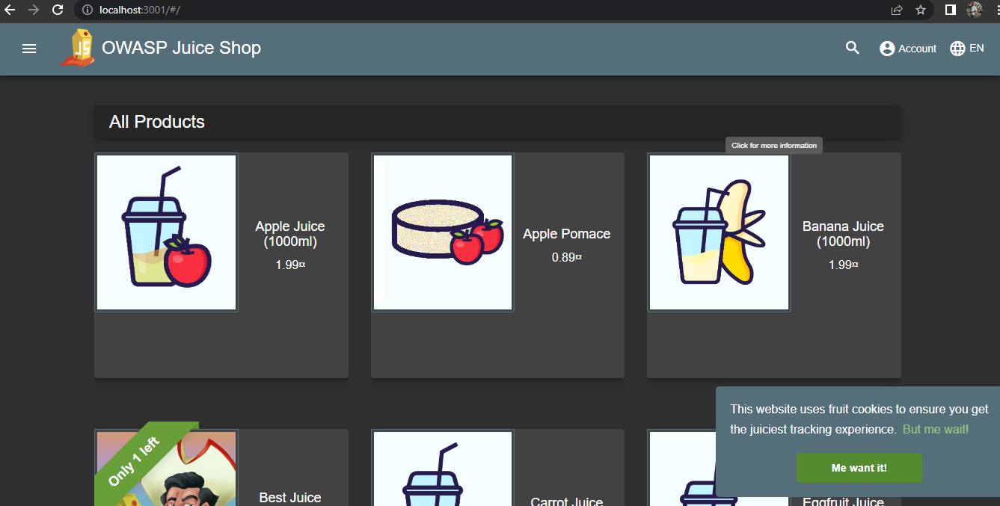
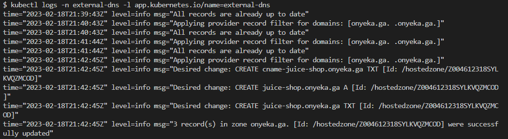
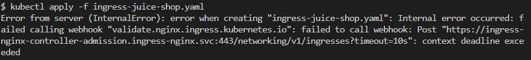
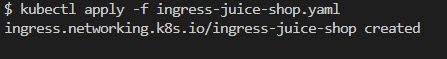
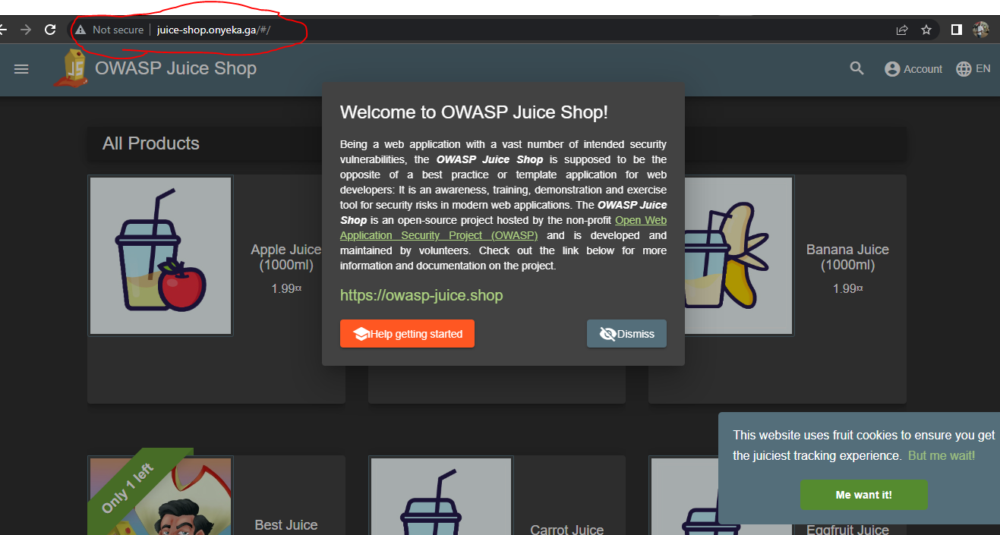
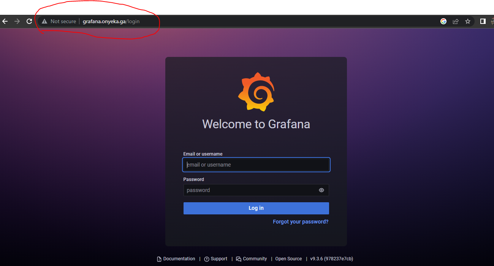
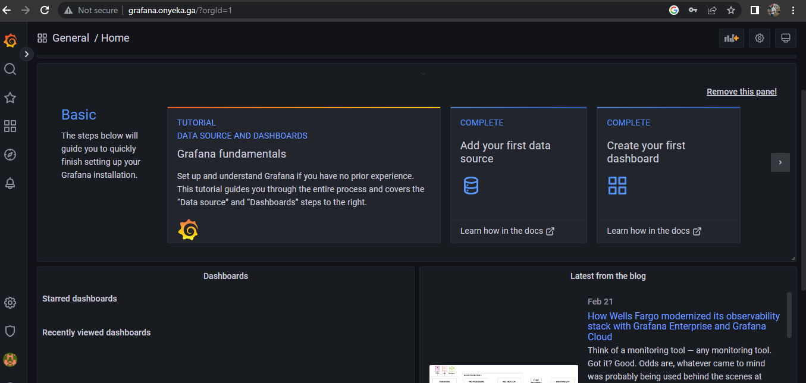
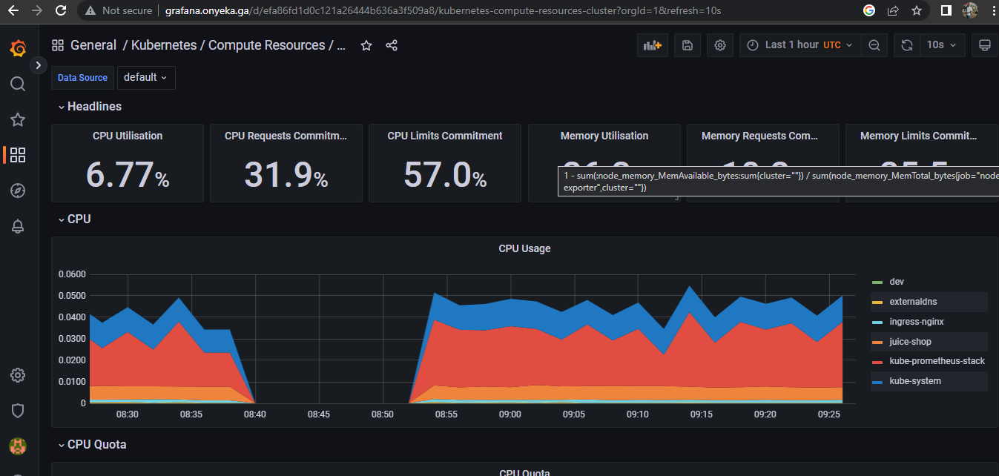

# Continuous Deployment with GitLab, Helm, and AWS EKS

This will show you how to deploy a complete CI/CD pipeline on AWS EKS

## Module 1

- Get ready!

- Our sample application

- Deploying our ELS cluster

- Quick Kubernetes review

- Accessing internal services

- DNS, Ingress, Metrics

## Module 2

- Managing stacks with Helm

- ExternalDNS

- Installing Traefik

- Installing metrics-server

- Prometheus and Grafana

- cert-manager

- CI/CD with GitLab

## Get ready!
We're going to set up a whole Continous Deployment pipeline
... for Kubernetes apps
... on a Kubernetes cluster
Ingredients: cert-manager, GitLab, Helm, AWS DNS, EKS, NGINX-INGRESS

### What we're going to do
- Spin up an EKS cluster
- Run a simple test app
- Install a few extras
- Set up GitLab
- Push an app with a CD pipeline to GitLab

### What you need to have
If you want to run this on your own...
- AWS account
- A domain name that you will point to AWS DNS(I got onyeka.ga)
- Local tools to control your Kubernetes cluster:
        kubectl
        helm
- Patience, as many operations will require us to wait a few minutes!

### Why do I need a domain name?
- Because accessing gitlab.onyeka.ga is easier than 102.34.55.67
- Because we'll need TLS certificates (and it's very easy to obtain certs with Let's Encrypt when we have a domain)
- We'll illustrate automatic DNS configuration with ExternalDNS, too! (Kubernetes will automatically create DNS entries in our domain)

### Warning ⚠️💸
- We're going to spin up cloud resources
- Remember to shut them down when you're done!
- In the immortal words of Cloud Economist Corey Quinn: You're charged for what you forget to turn off.

### Deploying our EKS cluster
- If we wanted to deploy Kubernetes manually, what would we need to do? (not that I recommend doing that...)
- Control plane (etcd, API server, scheduler, controllers)
- Nodes (VMs with a container engine + the Kubelet agent; CNI setup)
- High availability (etcd clustering, API load balancer)
- Security (CA and TLS certificates everywhere)
- Cloud integration (to provision LoadBalancer services, storage...)
- And that's just to get a basic cluster! 
- Refer to https://github.com/onyeka-hub/Project-21.git for guidelines

### Managed Kubernetes
- Cloud provider runs the control plane (including etcd, API load balancer, TLS setup, cloud integration)
- We or cloud provider run nodes (the cloud provider generally gives us an easy way to provision them)
- Get started in minutes
- We're going to use AWS EKS Kubernetes Engine

### Creating a cluster
From your command line, using Terraform deploy a version of eks of your choice
Refer to https://github.com/onyeka-hub/terraform-eks-module-official.git

### Quick Kubernetes review
- Let's deploy a simple HTTP server
- And expose it to the outside world!
- Feel free to skip this section if you're familiar with Kubernetes

### Creating a container
On Kubernetes, one doesn't simply run a container

We need to create a "Pod"

A Pod will be a group of containers running together (often, it will be a group of one container)

We can create a standalone Pod, but generally, we'll use a controller (for instance: Deployment, Replica Set, Daemon Set, Job, Stateful Set...)

The controller will take care of scaling and recreating the Pod if needed (note that within a Pod, containers can also be restarted automatically if needed)

### A controller, you said?
We're going to use one of the most common controllers: a Deployment

#### Deployments...
- can be scaled (will create the requested number of Pods)
- will recreate Pods if e.g. they get evicted or their Node is down
- handle rolling updates
- Deployments actually delegate a lot of these tasks to Replica Sets
- We will generally have the following hierarchy:
- Deployment → Replica Set → Pod

#### Exposing the Deployment
- We need to create a Service
- We can use kubectl expose for that 
- For internal use, we can use the default Service type, ClusterIP:
        `kubectl expose deployment web --port=80`
- For external use, we can use a Service of type LoadBalancer:
        `kubectl expose deployment web --port=80 --type=LoadBalancer`

#### Changing the Service type
- We can kubectl delete service web and recreate it
- Or, kubectl edit service web and dive into the YAML
- Or, kubectl patch service web --patch '{"spec": {"type": "LoadBalancer"}}'
- ... These are just a few "classic" methods; there are many ways to do this!

#### Deployment → Pod
- Can we check exactly what's going on when the Pod is created?

- Option 1: watch kubectl get all
        - displays all object types
        - refreshes every 2 seconds
        - puts a high load on the API server when there are many objects

- Option 2: kubectl get pods --watch --output-watch-events
        - can only display one type of object
        - will show all modifications happening (à la tail -f)
        - doesn't put a high load on the API server (except for initial display)

### Accessing internal services
- How can we temporarily access a service without exposing it to everyone?
- kubectl proxy: gives us access to the API, which includes a proxy for HTTP resources
- kubectl port-forward: allows forwarding of TCP ports to arbitrary pods, services, ...

#### kubectl proxy in theory
- Running kubectl proxy gives us access to the entire Kubernetes API
- The API includes routes to proxy HTTP traffic
- These routes look like the following:
        `/api/v1/namespaces/<namespace>/services/<service>/proxy`
- We just add the URI to the end of the request, for instance:
        `/api/v1/namespaces/<namespace>/services/<service>/proxy/index.html`
- We can access services and pods this way

#### kubectl proxy in practice
- Let's access the web service through kubectl proxy
- Run an API proxy in the background:
        `kubectl proxy &`
- Access the web service:
        `curl localhost:8001/api/v1/namespaces/default/services/web/proxy/`
- Terminate the proxy:
        `kill %1`

#### kubectl port-forward in theory
- What if we want to access a TCP service?
- We can use kubectl port-forward instead
- It will create a TCP relay to forward connections to a specific port (of a pod, service, deployment...)
- The syntax is:
        `kubectl port-forward service/name_of_service local_port:remote_port`

- If only one port number is specified, it is used for both local and remote ports  

#### kubectl port-forward in practice
- Let's access our remote NGINX server
- Forward connections from local port 1234 to remote port 80:
        `kubectl port-forward svc/web 1234:80 &`
- Connect to the NGINX server:
        `curl localhost:1234`
- Terminate the port forwarder:
        `kill %1`

## DNS, Ingress, Metrics
- We got a basic app up and running
- We accessed it over a raw IP address
- Can we do better? (i.e. access it with a domain name!)
- How much resources is it using?

### DNS
- We'd like to associate a fancy name to that LoadBalancer Service (e.g. nginx.onyeka.ga → A.B.C.D)
- option 1: manually add a DNS record
- option 2: find a way to create DNS records automatically
- We will install ExternalDNS to automate DNS records creatoin
- ExternalDNS supports AWS DNS and dozens of other providers

### Ingress
- What if we have multiple web services to expose?
- We could create one LoadBalancer Service for each of them
- This would create a lot of cloud load balancers (and they typically incur a cost, even if it's a small one)
- Instead, we can use an Ingress Controller
- Ingress Controller = HTTP load balancer / reverse proxy
- Put all our HTTP services behind a single LoadBalancer Service
- Can also do fancy "content-based" routing (using headers, request path...)
- We will install nginx as our Ingress Controller

### Metrics
- How much resources are we using right now?
- When will we need to scale up our cluster?
- We need metrics!
- We're going to install the metrics server
- It's a very basic metrics system (no retention, no graphs, no alerting...)
- But it's lightweight, and it is used internally by Kubernetes for autoscaling

### What's next
- We're going to install all these components
- Very often, things can be installed with a simple YAML file
- Very often, that YAML file needs to be customized a little bit (add command-line parameters, provide API tokens...)
- Instead, we're going to use Helm charts
- Helm charts give us a way to customize what we deploy
- Helm can also keep track of what we install (for easier uninstall and updates)

## Helm concepts
- helm is a CLI tool
- It is used to find, install, upgrade charts
- A chart is an archive containing templatized YAML bundles
- Charts are versioned
- Charts can be stored on private or public repositories

### Charts and repositories
A repository (or repo in short) is a collection of charts. It's just a bunch of files, (they can be hosted by a static HTTP server, or on a local directory).

We can add "repos" to Helm, giving them a nickname. The nickname is used when referring to charts on that repo. (for instance, if we try to install hello/world, that means the chart world on the repo hello; and that repo hello might be something like https://blahblah.hello.io/charts/)

### How to find charts
Go to the Artifact Hub (https://artifacthub.io). Or use helm search hub ... from the CLI. Let's try to find a Helm chart for something called "OWASP Juice Shop"!. (it is a famous demo app used in security challenges)

### Finding charts from the CLI
We can use helm search hub <keyword>

Look for the OWASP Juice Shop app:

`helm search hub owasp juice`

Since the URLs are truncated, try with the YAML output:

`helm search hub owasp juice -o yaml`

Then go to → https://artifacthub.io/packages/helm/seccurecodebox/juice-shop

### Finding charts on the web
We can also use the Artifact Hub search feature. Go to https://artifacthub.io/. In the search box on top, enter "owasp juice". Click on the "juice-shop" result (not "multi-juicer" or "juicy-ctf")

### Installing the chart
- Click on the "Install" button, it will show instructions
- First, add the repository for that chart:
  ```
  helm repo add securecodebox https://charts.securecodebox.io/
  ```

- Then, install the chart:
  ```
  helm upgrade --install juice-shop securecodebox/juice-shop  --namespace juice-shop --create-namespace
  ```

Note: it is also possible to install directly a chart, with --repo https://...

### Charts and releases
"Installing a chart" means creating a release. In the previous exemple, the release was named "my-juice-shop". We can also use --generate-name to ask Helm to generate a name for us.

List the releases:
  ```
  helm list
  ```

Check that we have a my-juice-shop-... Pod up and running:
  ```
  kubectl get pods
  ```

### Viewing resources of a release
This specific chart labels all its resources with a release label. We can use a selector to see these resources

List all the resources created by this release:
  ```
  kubectl get all --selector=app.kubernetes.io/instance=juice-shop
  ```

Note: this label wasn't added automatically by Helm.
It is defined in that chart. In other words, not all charts will provide this label.

### Configuring a release
By default, juice/juice-shop creates a service of type ClusterIP. We would like to change that to a NodePort. We could use kubectl edit service my-juice-shop, but  our changes would get overwritten next time we update that chart!

Instead, we are going to set a value. Values are parameters that the chart can use to change its behavior. Values have default values. Each chart is free to define its own values and their defaults.

### Checking possible values
We can inspect a chart with helm show or helm inspect
Look at the README for the app:

  ```
  helm show readme juice/juice-shop
  ```

Look at the values and their defaults:

  ```
  helm show values juice/juice-shop
  ```

The values may or may not have useful comments. The readme may or may not have (accurate) explanations for the values. (If we're unlucky, there won't be any indication about how to use the values!)

### Setting values
Values can be set when installing a chart, or when upgrading it. We are going to update my-juice-shop to change the type of the service.

Update my-juice-shop:
  ```
  helm upgrade my-juice-shop juice/juice-shop --set service.type=NodePort
  ```

Note that we have to specify the chart that we use (juice/my-juice-shop), even if we just want to update some values.

We can set multiple values. If we want to set many values, we can use -f/--values and pass a YAML file with all the values.

All unspecified values will take the default values defined in the chart.

### Connecting to the Juice Shop
Let's check the app that we just installed.

Check the node port allocated to the service:
  ```
  kubectl get service my-juice-shop
  ```

PORT=$(kubectl get service my-juice-shop -o jsonpath={..nodePort})

Connect to it:
  ```
  curl localhost:$PORT/
  ```




## ExternalDNS
ExternalDNS will automatically create DNS records from Kubernetes resources

        - Services (with the annotation external-dns.alpha.kubernetes.io/hostname)
        - Ingresses (automatically)

It requires a domain name (obviously)... And that domain name should be configurable through an API. As of April 2021, it supports a few dozens of providers. We're going to use AWS DNS.

### Deploying ExternalDNS
The ExternalDNS documentation has a tutorial for AWS. It's basically a lot of YAML! That's where using a Helm chart will be very helpful. There are a few ExternalDNS charts available out there. We will use the one from  https://kubernetes-sigs.github.io/external-dns/ .

### How we'll install things with Helm
We will install each chart in its own namespace. (this is not mandatory, but it helps to see what belongs to what).

We will use helm upgrade --install instead of helm install, (that way, if we want to change something, we can just re-run the command)

We will use the --create-namespace and --namespace ... options

To keep things boring and predictible, if we are installing chart xyz:

        - we will install it in namespace xyz
        - we will name the release xyz as well

### Installing ExternalDNS
First, let's add the Externaldns repo:

helm repo add external-dns https://kubernetes-sigs.github.io/external-dns/

To set up externaldns on aws eks cluster, please refer to this documentation for the neccessary steps like permission, externaldns service account, etc before installation.

#### Short description
ExternalDNS is a pod that runs in your Amazon EKS cluster. To use ExternalDNS as a plugin with Amazon EKS, set up AWS Identity and Access Management (IAM) permissions. These permissions must allow Amazon EKS access to Amazon Route 53.

**Note**: Before starting the following resolution, make sure that a domain name and a Route 53 hosted zone exist.
### Steps
1. Set up IAM permissions to give the ExternalDNS pod permissions to create, update, and delete Route 53 records in your AWS account.

From the aws console create an IAM policy with the policy below and name it 'externaldns':
```
{
  "Version": "2012-10-17",
  "Statement": [
    {
      "Effect": "Allow",
      "Action": [
        "route53:ChangeResourceRecordSets"
      ],
      "Resource": [
        "arn:aws:route53:::hostedzone/*"
      ]
    },
    {
      "Effect": "Allow",
      "Action": [
        "route53:ListHostedZones",
        "route53:ListResourceRecordSets"
      ],
      "Resource": [
        "*"
      ]
    }
  ]
}
```
**Note**: You can also adjust the preceding policy to allow updates to explicit hosted zone IDs.

2. Use the preceding policy to create an IAM role for the service account:
```
eksctl create iamserviceaccount --name SERVICE_ACCOUNT_NAME --namespace NAMESPACE --cluster CLUSTER_NAME --attach-policy-arn IAM_POLICY_ARN --approve
```
Or
```
eksctl create iamserviceaccount --name external-dns --namespace external-dns --cluster onyeka-eks-official --attach-policy-arn arn:aws:iam::958217526797:policy/external-dns --approve
```

To check the name of your service account, run the following command:
```
kubectl get sa -n external-dns
```
Example output:
```
NAME           SECRETS   AGE
default        1         23h
external-dns   1         23h
```

In the preceding example output, external-dns is the name that was given to the service account when it was created. Make sure you have eksctl intalled on your system.

3. Then, install ExternalDNS:
```
helm upgrade --install external-dns external-dns/external-dns \
  --namespace external-dns --create-namespace \
  --set serviceAccount.create=false,serviceAccount.name=extternaldns
```
Or
```
helm upgrade --install external-dns external-dns/external-dns --set serviceAccount.create=false,serviceAccount.name=external-dns --namespace external-dns
```
4.    Verify that the deployment was successful:
```
kubectl get deployments -n external-dns
```
Example output:
```
NAME           READY   UP-TO-DATE   AVAILABLE   AGE
external-dns   1/1     1            1           85m
```
You can also check the logs to verify that the records are up to date:
```
kubectl logs external-dns-9f85d8d5b-sx5fg
```
Example output:
```
....
....
time="2022-02-10T20:22:02Z" level=info msg="Instantiating new Kubernetes client"
time="2022-02-10T20:22:02Z" level=info msg="Using inCluster-config based on serviceaccount-token"
time="2022-02-10T20:22:02Z" level=info msg="Created Kubernetes client https://10.100.0.1:443"
time="2022-02-10T20:22:09Z" level=info msg="Applying provider record filter for domains: [<yourdomainname>.com. .<yourdomainname>.com.]"
time="2022-02-10T20:22:09Z" level=info msg="All records are already up to date"
....
....
```

5. Verify that ExternalDNS is working
- In our own case where we already have the juice-shop service which is currently a ClusterIP type, update this service to type LoadBalancer and annotate with external-dns configuration.

- Or Create a service that's exposed as LoadBalancer and that can be routed externally through the domain name that's hosted on Route 53 or edit the juice-shop service to a type LoadBalancer and annotate it.

Manifest:
```
apiVersion: v1
kind: Service
metadata:
  name: nginx
  annotations:
    external-dns.alpha.kubernetes.io/hostname: DOMAIN_NAME
spec:
  ports:
    - port: 80
      targetPort: 80
      protocol: TCP
  type: LoadBalancer
  selector:
    app: nginx
```
```
kubectl apply SERVICE_MANIFEST_FILE_NAME.yaml
```

- Check that the NGINX service was created with the LoadBalancer type:
```
kubectl get svc
```
Example output:
```
NAME         TYPE           CLUSTER-IP      EXTERNAL-IP                                                              PORT(S)        AGE
kubernetes   ClusterIP      10.100.0.1      <none>                                                                   443/TCP        26h
nginx        LoadBalancer   10.100.234.77   a1ef09255d52049f487e05b4f74faea6-954147917.us-west-1.elb.amazonaws.com   80:30792/TCP   74m
```

Note: The service automatically creates a Route 53 record for the hosted zone.

Check the logs to verify that the Route 53 record was created:
```
kubectl logs external-dns-9f85d8d5b-sx5fg
```
Example output:
```
...
...
...
time="2022-02-10T21:22:43Z" level=info msg="Applying provider record filter for domains: [<domainname>.com. .<domainname>.com.]"
time="2022-02-10T21:22:43Z" level=info msg="Desired change: CREATE <domainname>.com A [Id: /hostedzone/Z01155763Q6AN7CEI3AP6]"
time="2022-02-10T21:22:43Z" level=info msg="Desired change: CREATE <domainname>.com TXT [Id: /hostedzone/Z01155763Q6AN7CEI3AP6]"
time="2022-02-10T21:22:43Z" level=info msg="2 record(s) in zone xxx.com. [Id: /hostedzone/Z01155763Q6AN7CEI3AP6] were successfully updated"
time="2022-02-10T21:23:43Z" level=info msg="Applying provider record filter for domains: [<domainname>.com. .<domainname>.com.]"
time="2022-02-10T21:23:43Z" level=info msg="All records are already up to date"
...
...
...
```



For more information and examples for ExternalDNS, see Setting up ExternalDNS for services on AWS (on the GitHub website) and Set up ExternalDNS (on the Kubernetes website).


## Installing Ingress-Nginx
Nginx is going to be our Ingress Controller

Let's install it with a Helm chart, in its own namespace

First, let's add the nginx chart repository:
```
helm repo add ingress-nginx https://kubernetes.github.io/ingress-nginx
or
helm repo update
```

Then, install the chart:
```
helm upgrade -i ingress-nginx ingress-nginx/ingress-nginx \
    --version 4.2.3 \
    --create-namespace --namespace ingress-nginx\
```
```
helm upgrade -i ingress-nginx ingress-nginx/ingress-nginx --version 4.2.3 --create-namespace --namespace ingress-nginx 
```

Checking the ingress controller
```
kubectl -n ingress-nginx rollout status deployment ingress-nginx-controller

kubectl get deployment -n ingress-nginx ingress-nginx-controller
```


### Testing Ingress-nginx
Let's create an Ingress resource!

Create an ingress-juice-shop.yaml file with the code below:
```
apiVersion: networking.k8s.io/v1
kind: Ingress
metadata:
  name: "ingress-juice-shop"
  namespace: juice-shop
spec:
  ingressClassName: nginx
  rules:
  - host: "juice-shop.onyeka.ga"
    http:
      paths:
      - pathType: Prefix
        path: "/"
        backend:
          service:
            name: juice-shop
            port:
              number: 80
```

Deploy the Ingress by running the following:
```
kubectl apply -f ingress-juice-shop.yaml
```
**Note**: Make sure that the juice-shop service is listening on port 80 otherwise edit it
## Blocker
```
$ kubectl apply -f ingress-juice-shop.yaml 
Error from server (InternalError): error when creating "ingress-juice-shop.yaml": Internal error occurred: failed calling webhook "validate.nginx.ingress.kubernetes.io": failed to call webhook: Post "https://ingress-nginx-controller-admission.ingress-nginx.svc:443/networking/v1/ingresses?timeout=10s": context deadline exceeded
```



### Solution
I was recommended to remove the ValidatingWebhookConfiguration from the applied manfiest. You can also remove it manually with
```
kubectl delete ValidatingWebhookCOnfiguration ingress-nginx-admission
```

(Validating Controllers aren't namespaced)

Applying the file again and it was created.



After a short delay (IP address binding may take a bit longer) we should be able to see the state of the Ingress resource:

Check that the Ingress was correctly created:
```
kubectl get ingress -n juice-shop

kubectl describe ing ingress-juice-shop -n juice-shop
```

```
$ kubectl get ingress -n juice-shop
NAME                 CLASS   HOSTS                  ADDRESS                                                 
                 PORTS   AGE
ingress-juice-shop   nginx   juice-shop.onyeka.ga   a5f112bc442eb49f9a9607e1280dc5b7-643046540.us-east-2.elb.amazonaws.com   80      3m6s
```

### Does it work?
Try to connect to the Ingress host name (in my example, http://juice-shop.onyeka.ga/)




## Installing metrics-server
We've installed a few things on our cluster so far

How much resources (CPU, RAM) are we using?

We need metrics!

If metrics-server is installed, we can get Nodes metrics like this:
```
kubectl top nodes
```
At the moment, this should show us error: Metrics API not available

How do we fix this?

### Many ways to get metrics
We could use a SAAS like Datadog, New Relic...

We could use a self-hosted solution like Prometheus

Or we could use metrics-server

What's special about metrics-server?

### Pros/cons
#### Cons:

no data retention (no history data, just instant numbers)

only CPU and RAM of nodes and pods (no disk or network usage or I/O...)

#### Pros:

very lightweight

doesn't require storage

used by Kubernetes autoscaling

### Why metrics-server
We may install something fancier later, (think: Prometheus with Grafana). But metrics-server will work in minutes. It will barely use resources on our cluster. It's required for autoscaling anyway

### How metric-server works
It runs a single Pod

That Pod will fetch metrics from all our Nodes

It will expose them through the Kubernetes API agregation layer

### Installing metrics-server
1. Deploy the Metrics Server with the following command:

```
kubectl apply -f https://github.com/kubernetes-sigs/metrics-server/releases/latest/download/components.yaml
```

2. Verify that the metrics-server deployment is running the desired number of pods with the following command.

```
kubectl get deployment metrics-server -n kube-system
```

The example output is as follows.
```
NAME             READY   UP-TO-DATE   AVAILABLE   AGE
metrics-server   1/1     1            1           6m
```

In a lot of places, this is done with a little bit of custom YAML (derived from the official installation instructions). We're going to use Helm one more time:

```
helm upgrade --install metrics-server bitnami/metrics-server \
  --create-namespace --namespace metrics-server \
  --set apiService.create=true \
  --set extraArgs.kubelet-insecure-tls=true \
  --set extraArgs.kubelet-preferred-address-types=InternalIP
```

What are these options for?

### Installation options
apiService.create=true

register metrics-server with the Kubernetes agregation layer

(create an entry that will show up in kubectl get apiservices)

extraArgs.kubelet-insecure-tls=true

when connecting to nodes to collect their metrics, don't check kubelet TLS certs

(because most kubelet certs include the node name, but not its IP address)

extraArgs.kubelet-preferred-address-types=InternalIP

when connecting to nodes, use their internal IP address instead of node name

(because the latter requires an internal DNS, which is rarely configured)

### Testing metrics-server
After a minute or two, metrics-server should be up

We should now be able to check Nodes resource usage:

```
kubectl top nodes
```

And Pods resource usage, too:

```
kubectl top pods --all-namespaces
```

### Keep some padding
The RAM usage that we see should correspond more or less to the Resident Set Size

Our pods also need some extra space for buffers, caches...

Do not aim for 100% memory usage!

Some more realistic targets:

50% (for workloads with disk I/O and leveraging caching)

90% (on very big nodes with mostly CPU-bound workloads)

75% (anywhere in between!)


## Prometheus and Grafana
What if we want metrics retention, view graphs, trends?. A very popular combo is Prometheus+Grafana:

Prometheus as the "metrics engine"

Grafana to display comprehensive dashboards

Prometheus also has an alert-manager component to trigger alerts

### Installing Prometheus and Grafana
- A complete metrics stack needs at least:

        - the Prometheus server (collects metrics and stores them efficiently)
        - a collection of exporters (exposing metrics to Prometheus)
        - Grafana
        - a collection of Grafana dashboards (building them from scratch is tedious)

- The Helm chart kube-prometheus-stack combines all these elements

- ... So we're going to use it to deploy our metrics stack!

### Installing kube-prometheus-stack
Let's install that stack directly from its repo (without doing helm repo add first)

Otherwise, keep the same naming strategy:

```
helm upgrade --install kube-prometheus-stack kube-prometheus-stack \
  --namespace kube-prometheus-stack --create-namespace \
  --repo https://prometheus-community.github.io/helm-charts
```
Or
```
helm upgrade --install kube-prometheus-stack kube-prometheus-stack --namespace kube-prometheus-stack --create-namespace --repo https://prometheus-community.github.io/helm-charts
```

This will take a minute...

Then check what was installed:
```
kubectl get all --namespace kube-prometheus-stack
```

### Exposing Grafana
Let's create an Ingress for Grafana

```
kubectl create ingress --namespace kube-prometheus-stack grafana \
  --rule=grafana.onyeka.ga/*=kube-prometheus-stack-grafana:80
```
Or create and apply ingress-grafana.yaml with the code below:

```
apiVersion: networking.k8s.io/v1
kind: Ingress
metadata:
  name: "ingress-grafana"
  namespace: kube-prometheus-stack
spec:
  ingressClassName: nginx
  rules:
  - host: "grafana.onyeka.ga"
    http:
      paths:
      - pathType: Prefix
        path: "/"
        backend:
          service:
            name: kube-prometheus-stack-grafana
            port:
              number: 80
```

Connect to Grafana at grafana.onyeka.ga, (remember that the DNS record might take a few minutes to come up)



### Grafana credentials
What could the login and password be?

Let's look at the Secrets available in the namespace:

```
kubectl get secrets --namespace kube-prometheus-stack
```
There is a kube-prometheus-stack-grafana that looks promising!

Decode the Secret:
```
kubectl get secret --namespace kube-prometheus-stack \
  kube-prometheus-stack-grafana -o json | jq '.data | map_values(@base64d)'
```

If you don't have the jq tool mentioned above, don't worry...

The login/password is hardcoded to admin/prom-operator 😬

Or you run a describe on the grafana secret and base64 decode the admin-password and the admin-user.
```
$ kubectl get secret kube-prometheus-stack-grafana -n kube-prometheus-stack -o yaml
apiVersion: v1
data:
  admin-password: cHJvbS1vcGVyYXRvcg==
  admin-user: YWRtaW4=
  creationTimestamp: "2023-02-21T15:35:47Z"
  labels:
    app.kubernetes.io/instance: kube-prometheus-stack
    app.kubernetes.io/managed-by: Helm
    app.kubernetes.io/name: grafana
    app.kubernetes.io/version: 9.3.6
    helm.sh/chart: grafana-6.50.7
  name: kube-prometheus-stack-grafana
  namespace: kube-prometheus-stack
  resourceVersion: "124183"
  uid: f8852104-9e29-4755-b1a1-51243a462605
type: Opaque
```



### Grafana dashboards
Once logged in, click on the "Dashboards" icon on the left, (it's the one that looks like four squares). Then click on the "Manage" entry

Then click on "Kubernetes / Compute Resources / Cluster"

This gives us a breakdown of resource usage by Namespace

Feel free to explore the other dashboards!




## cert-manager
cert-manager¹ facilitates certificate signing through the Kubernetes API:

- we create a Certificate object (that's a CRD)

- cert-manager creates a private key

- it signs that key ...

- ... or interacts with a certificate authority to obtain the signature

- it stores the resulting key+cert in a Secret resource

These Secret resources can be used in many places (Ingress, mTLS, ...)

### Getting signatures
cert-manager can use multiple Issuers (another CRD), including:

- self-signed
- cert-manager acting as a CA
- the ACME protocol (notably used by Let's Encrypt)
- HashiCorp Vault

Multiple issuers can be configured simultaneously

Issuers can be available in a single namespace, or in the whole cluster

(then we use the ClusterIssuer CRD)

### cert-manager in action
We will install cert-manager

We will create a ClusterIssuer to obtain certificates with Let's Encrypt, (this will involve setting up an Ingress Controller)

We will create a Certificate request

cert-manager will honor that request and create a TLS Secret

### Installing cert-manager

### Steps
1. Set up an IAM Role
cert-manager needs to be able to add records to Route53 in order to solve the DNS01 challenge. To enable this, create a IAM policy with the name PolicyForCertManager, with following permissions:

```
{
  "Version": "2012-10-17",
  "Statement": [
    {
      "Effect": "Allow",
      "Action": "route53:GetChange",
      "Resource": "arn:aws:route53:::change/*"
    },
    {
      "Effect": "Allow",
      "Action": [
        "route53:ChangeResourceRecordSets",
        "route53:ListResourceRecordSets"
      ],
      "Resource": "arn:aws:route53:::hostedzone/*"
    },
    {
      "Effect": "Allow",
      "Action": "route53:ListHostedZonesByName",
      "Resource": "*"
    }
  ]
}
```

**Note**: The route53:ListHostedZonesByName statement can be removed if you specify the (optional) hostedZoneID. You can further tighten the policy by limiting the hosted zone that cert-manager has access to (e.g. arn:aws:route53:::hostedzone/DIKER8JEXAMPLE).

2. Create the IAM role for cert-manager. After you create the IAM policy, you must create an IAM role with **Select trusted entity - Custom trust policy**. Use the trustpolicy.json sample file below as a guide.

```
{
    "Version": "2012-10-17",
    "Statement": [
        {
            "Effect": "Allow",
            "Principal": {
                "Federated": "arn:aws:iam::958217526797:oidc-provider/oidc.eks.us-east-2.amazonaws.com/id/8BB983F9CC161E9DF9D69E994B6F6F3E"
            },
            "Action": "sts:AssumeRoleWithWebIdentity",
            "Condition": {
                "StringEquals": {
                    "oidc.eks.us-east-2.amazonaws.com/id/8BB983F9CC161E9DF9D69E994B6F6F3E:sub": "system:serviceaccount:cert-manager:cert-manager",
                    "oidc.eks.us-east-2.amazonaws.com/id/8BB983F9CC161E9DF9D69E994B6F6F3E:aud": "sts.amazonaws.com"
                }
            }
        }
    ]
}
```

3. Create a Kubernetes service account and associate it with IAM role. You can use eksctl command bellow. **Note**: create the cert-manager namespace before running the command:

```
eksctl create iamserviceaccount --name my-service-account --namespace default --cluster my-cluster --attach-role-arn <ARN of the role to attach to the iamserviceaccount> --approve
```

Or
```
eksctl create iamserviceaccount --name cert-manager --namespace cert-manager --cluster onyeka-eks-19-8-0 --attach-role-arn arn:aws:iam::958217526797:role/RoleForCertManager --approve
```

To check the name of your service account, run the following command:
```
kubectl get sa -n cert-manager
```
Example output:
```
NAME           SECRETS   AGE
default        1         23h
cert-manager   1         23h
```

In the preceding example output, cert-manager is the name that was given to the service account when it was created. Make sure you have eksctl intalled on your system.

4. Create a secret for the cert-manager sa if it does not exist with the below yaml file.

```yaml
apiVersion: v1
kind: Secret
metadata:
  name: cert-manager
  namespace:  cert-manager
  annotations:
    kubernetes.io/service-account.name: "cert-manager"
type: kubernetes.io/service-account-token
```


5. Then, install cert-manager:

Before installing the chart, you must first install the cert-manager CustomResourceDefinition resources. This is performed in a separate step to allow you to easily uninstall and reinstall cert-manager without deleting your installed custom resources.

```
kubectl apply -f https://github.com/cert-manager/cert-manager/releases/download/v1.11.0/cert-manager.crds.yaml

## Add the Jetstack Helm repository
helm repo add jetstack https://charts.jetstack.io

## Install the cert-manager helm chart
helm upgrade -i cert-manager --version v1.11.0 jetstack/cert-manager -n cert-manager --set serviceAccount.create=false,serviceAccount.name=cert-manager

OR Let's add the repo and install the cert-manager Helm chart with this one-liner:

helm install cert-manager cert-manager \
    --repo https://charts.jetstack.io \
    --create-namespace --namespace cert-manager \
```

If you want to completely uninstall cert-manager from your cluster, you will also need to delete the previously installed CustomResourceDefinition resources:
```
kubectl delete -f https://github.com/cert-manager/cert-manager/releases/download/v1.11.0/cert-manager.crds.yam
```

6. Verify that the deployment was successful:
```
kubectl get deployments -n cert-manager

NAME                      READY   UP-TO-DATE   AVAILABLE   AGE
cert-manager              1/1     1            1           89s
cert-manager-cainjector   1/1     1            1           89s
cert-manager-webhook      1/1     1            1           89s
```
### ClusterIssuer manifest
Create a cm-clusterissuer.yaml with the below code

```
apiVersion: cert-manager.io/v1
kind: ClusterIssuer
metadata:
  name: letsencrypt-staging
spec:
  acme:
    email: "onyekagodonu@yahoo.com"
    server: https://acme-staging-v02.api.letsencrypt.org/directory
    # To use the production environment, use the following line instead:
    #server: https://acme-v02.api.letsencrypt.org/directory
    privateKeySecretRef:
      name: letsencrypt-staging
    solvers:
    - selector:
        dnsZones:
          - "onyeka.ga"
      dns01:
        route53:
          region: "us-east-2"
          hostedZoneID: "Z0250004LZ1MP3VIBU47"
```

Create the ClusterIssuer:
```
kubectl apply -f cm-clusterissuer.yaml

kubectl get clusterissuer

NAME                  READY   AGE
letsencrypt-staging   True    7m36s
```

### Lets use the clusterissuer
1. First, lets see the manual way of using that. This is like telling the cert-manager to get the certificate for you. Note that certificates lives within a namespace

- Lets create the certificate

```
#certificate.yaml manifest
apiVersion: cert-manager.io/v1
kind: Certificate
metadata:
  name: juice-shop.onyeka.ga
spec:
  secretName: juice-shop.onyeka.ga
  dnsNames:
  - juice-shop.onyeka.ga
  issuerRef:
    name: letsencrypt-staging
    kind: ClusterIssuer
```

The name, secretName, and dnsNames don't have to match.

There can be multiple dnsNames.

The issuerRef must match the ClusterIssuer that we created earlier.

Apply the certificate.yaml file

```
kubectl apply -f certificate.yaml -n juice-shop
```
#### What's happening?
cert-manager will create: the secret key, a Pod, a Service, and an Ingress to complete the HTTP challenge. Then it waits for the challenge to complete

View the resources created by cert-manager:

```
$ kubectl get pods,services,ingresses --selector=acme.cert-manager.io/http01-solver=true -n dev

NAME                            READY   STATUS    RESTARTS   AGE
pod/cm-acme-http-solver-svr7d   1/1     Running   0          13m

NAME                                TYPE       CLUSTER-IP       EXTERNAL-IP   PORT(S)          AGE
service/cm-acme-http-solver-lmdp8   NodePort   172.20.110.126   <none>        8089:30513/TCP   13m

NAME                                                  CLASS    HOSTS             ADDRESS                                        
                          PORTS   AGE
ingress.networking.k8s.io/cm-acme-http-solver-w6bxp   <none>   nginx.onyeka.ga   a5f112bc442eb49f9a9607e1280dc5b7-643046540.us-east-2.elb.amazonaws.com   80      13m
```

The cert-manager will create a challange to verify the ownership of the domain which will take some time, before it can be able to tell letsencrypt to issue a certificate. The certificate will only be created when the challange is successfull.

#### HTTP challenge
The CA (in this case, Let's Encrypt) will fetch a particular URL:

http://<our-domain>/.well-known/acme-challenge/<token>

Check the path of the Ingress in particular:

```
$ kubectl get ing -n dev
NAME                        CLASS    HOSTS             ADDRESS                                                                  PORTS   AGE
cm-acme-http-solver-w6bxp   <none>   nginx.onyeka.ga   a5f112bc442eb49f9a9607e1280dc5b7-643046540.us-east-2.elb.amazonaws.com   80      4m4s

$ kubectl describe ingress --selector=acme.cert-manager.io/http01-solver=true


$ kubectl describe ing cm-acme-http-solver-w6bxp -n dev
Name:             cm-acme-http-solver-w6bxp
Labels:           acme.cert-manager.io/http-domain=803997136
                  acme.cert-manager.io/http-token=1153175250
                  acme.cert-manager.io/http01-solver=true
Namespace:        dev
Address:          a5f112bc442eb49f9a9607e1280dc5b7-643046540.us-east-2.elb.amazonaws.com
Ingress Class:    <none>
Default backend:  <default>
Rules:
  Host             Path  Backends
  ----             ----  --------
  nginx.onyeka.ga
                   /.well-known/acme-challenge/FyVVYwClD86L9EYYjfQezni2iiWovTr4XPBzIHQkjY4   cm-acme-http-solver-lmdp8:8089 (10.0.0.156:8089)
Annotations:       kubernetes.io/ingress.class: nginx
                   nginx.ingress.kubernetes.io/whitelist-source-range: 0.0.0.0/0,::/0
Events:
  Type    Reason  Age                    From                      Message
  ----    ------  ----                   ----                      -------
  Normal  Sync    3m11s (x2 over 3m19s)  nginx-ingress-controller  Scheduled for sync
  ```

- A little bit later, we will have a kubernetes.io/tls Secret:

```
kubectl get secrets -n dev
```

### Automatic TLS Ingress with annotations
It is also possible to annotate Ingress resources for cert-manager

If we annotate an Ingress resource with `cert-manager.io/cluster-issuer=xxx:`

- cert-manager will detect that annotation

- it will obtain a certificate using the specified ClusterIssuer `(xxx)`

- it will store the key and certificate in the specified Secret

Note: the Ingress still needs the `tls` section with `secretName` and `hosts`

Let annotate the ingress for our juice-shop app and our grafana